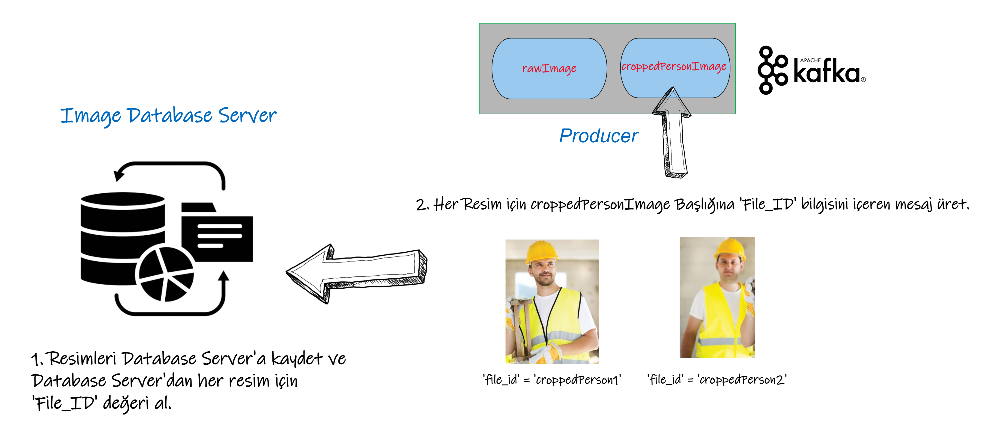

# Person Procective Equipment (PPE) Detection

## 1. Projenin Genel Mimarisi


Projenin genel mimarisini yukarıdaki şekilde görebilirsiniz. Projede 3 ana modül bulunmaktadır. Bunlar; Derin Öğrenme Modellerinin Çalıştırıldığı Modül, yapay zeka çıktıları ve sisteme yüklenen resim verilerinin bulut üzerinde saklandığı Veritabanı Modülü, kullanıcın resim verilerini ekosisteme yükleyebildiği ve tahmin sonuçları gözlemleyebildiği Kullanıcı Arayüzü Modülüdür.

Bu modüllerin hepsi aynı ekosistemi kullanmaktadır ve birbirleriyle sorunsuz bir şekilde haberleşmeleri gerekmektedir. Bu haberleşme işlemini yönetmek için ekosistemimiz Apache Kafka kullanmaktadır. Apache Kafka, birbirleriyle haberleşen uygulamaların birbirlerini tanımlamaları için bir isimlendirme sistemine ihtiyaç duyar. Bu isimlendirme sistemi için de Zookeeper kullanılmaktadır. Zookeeper, Kafka'nın kullandığı isimlendirme sistemi olup, Kafka'nın çalışması için zorunlu bir bileşendir.

Apache Kafka'nın yatay ölçeklenebilirlik özelliği sayesinde projemizdeki modüllerin sayısı arttırılabilir. Yeni modüllerini yükünü dağıtık sistemlere paylaştırabiliriz. Bu sayede sistemin performansı arttırılabiliriz. Yeni bir yapay zeka modeli eklemek istediğimizde, Kafka'ya yeni bir topic ekleyerek, yeni modeli sisteme dahil edebiliriz. Bu sayede sistemin genel performansı etkilenmeden yeni bir model ekleyebiliriz.

Sonuç olarak Apache Kafka bir orkestra şefi gibi çalışmaktadır. Sistemdeki tüm modüllerin birbiriyle haberleşmesini sağlamaktadır. Bu sayede sistemin performansı arttırılabilir ve sisteme yeni modüller eklenebilir.

## 2. Derin Öğrenme Modellerinin Çalıştırıldığı Modül

Her yapay zeka modeli kendisiyle ilişkili bir Kafka topic'ine Consumer(Tüketici) olarak bağlamıştır; 
* Person Detection ve Fire-Smoke Detection AI modelleri 'rawImage' başlığına,
* Image Upscaling AI modeli 'croppedPersonImage' başlığına,
* Age, Hardhat-Vest, Smoker Detection AI modelleri 'croppedPersonImage' başlığına Consumer(Tüketici) olarak bağlanmışlardır.

Yapay zeka modelleri Consumer olarak bağlı oldukları başlıktan mesaj aldıklarında, aldıkları mesajı işleyerek yeni bir mesaj üretirler;

* Person Detection AI modeli 'rawImage' başlığından aldığı veri üzerinde tahmin yapar ve insanların bulunduğu bölgeyi kırpıp 'croppedPersonImage' başlığına mesaj üretir.

* Fire-Smoke Detection AI modeli, 'rawImage' başlığından aldığı veri üzerinde tahmin yapar ve veri içerisinde yangın-duman tespit edip etmediğine göre 'fireResults' başlığına mesaj üretir. 

* Image Upscaling AI modeli, 'croppedPersonImage' başlığından aldığı veri üzerinde tahmin yapar ve veri içerisinde insanların bulunduğu bölgeyi yüksek çözünürlüğe çıkartıp 'upscaledPerson' başlığına mesaj üretir. 

* Age Detection AI modeli, 'croppedPersonImage' başlığından aldığı veri üzerinde tahmin yapar ve veri içerisindeki insanların yaşlarını tespit edip 'ageResults' başlığına mesaj üretir.

* Hardhat-Vest Detection AI modeli, 'croppedPersonImage' başlığından aldığı veri üzerinde tahmin yapar ve veri içerisindeki insanların kask ve yelek giyip giymediklerini tespit edip 'hardhatResults' başlığına mesaj üretir.

* Smoker Detection AI modeli, 'croppedPersonImage' başlığından aldığı veri üzerinde tahmin yapar ve veri içerisindeki insanların sigara içip içmediklerini tespit edip 'smokerResults' başlığına mesaj üretir.

### 2.1 Person Detection Modeli


* Person Detection AI modeli önce Consumer(Tüketici) olarak bağlı olduğu 'rawImage' başlığından mesaj alır. Aldığı mesaj içerisindeki 'File_ID' değerini kullanarak Resim Veritabanı'na sorgu atar ve resim verisini alır.

* Daha Sonra aldığı resim verisini Person Detection AI modeline gönderir. Person Detection AI modeli Microsoft COCO veri seti üzerinde eğitilmiş YOLOv8 algoritmasını kullanır. Bu algoritma sayesinde resim verisindeki insanların bulunduğu bölgeyi tespit eder. 

* Model tahmin yaparken Threshold değerini geçemeyen tahminlerin sonuçlarını eler. Bu sayede yanlış tahminlerin önüne geçer.



* Resmin içerisindeki tespit ettiği her kareyi Image Database Server'a kaydeder ve Database Server'dan kaydettiği her resim için unique(benzersiz) bir File_ID değeri alır.

* Aldığı File_ID değerlerini croppedPersonImage başlığına mesaj olarak gönderir. Böylece diğer AI modülleri File_ID değişkenini kullanarak Image Database Server'dan resim verisini çekebilecektir.

#### 2.1.1 utils.py Kod İncelemesi

* utils.py dosyası, projedeki tüm modüller tarafından kullanılan fonksiyonları içermektedir.

```
def read_ccloud_config(config_file):
    conf = {}
    with open(config_file) as fh:
        for line in fh:
            line = line.strip()
            if len(line) != 0 and line[0] != "#":
                parameter, value = line.strip().split('=', 1)
                conf[parameter] = value.strip()
    return conf
```

* `read_ccloud_config(config_file)` bir `config_file` adlı dosya alır ve bu dosyadaki yapılandırma ayarlarını bir sözlük olarak döndürür.

* Fonksiyon, `conf` adlı boş bir sözlük oluşturur. Ardından `open()` fonksiyonu ile `config_file` adlı dosyayı açar ve `fh` adlı bir dosya işaretçisi döndürür. `for` döngüsü, dosyadaki her satırı tek tek okur. Her satırın başındaki `#` işaretleri yorum satırlarını belirtir, bu nedenle bu satırlar atlanır.

* Satırların içeriği, eşittir (`=`) işaretine göre iki parçaya ayrılır. Bu iki parça, sırasıyla `parameter` ve `value` değişkenlerine atanır. Ardından, `parameter` anahtar kelimesi ve `value` değeri kullanılarak bir sözlük girdisi oluşturulur ve bu girdi `conf` sözlüğüne eklenir.

* Son olarak, fonksiyon `conf` sözlüğünü döndürür. Bu sözlük, dosyadaki yapılandırma ayarlarını anahtar-değer çiftleri olarak içerir. Dosyada bir anahtar birden fazla kez belirtilirse, son belirtilen değer sözlükte yer alacaktır.

```
def get_bytes_from_image_data(image_data):
    byteImgIO = BytesIO()
    image_data.save(byteImgIO, "PNG")       
    byteImgIO.seek(0)
    byteImg = byteImgIO.read()
    return byteImg

def get_image_data_from_bytes(byteImg):
    image_data = Image.open(BytesIO(byteImg))
    if image_data.mode != 'RGB':
        image_data = image_data.convert('RGB')
    return image_data

```

* `get_bytes_from_image_data(image_data)` fonksiyonu, Pillow kütüphanesi tarafından oluşturulan `image_data` değişkenini alır. Bu fonksiyon, `BytesIO()` sınıfını kullanarak boş bir bayt dizisi oluşturur ve `image_data` değişkenini PNG formatında bu bayt dizisine kaydeder. Ardından, bayt dizisini okumak için bayt dizi işaretçisini (byte stream) başa sıfırlar ve bayt dizisini okur. Fonksiyon son olarak bu bayt dizisini döndürür.

* `get_image_data_from_bytes(byteImg)` fonksiyonu ise, byte türündeki `byteImg` değişkenini alır. Bu fonksiyon, `BytesIO()` sınıfını kullanarak bayt dizisini bir bayt dizi işaretçisine yükler ve `Image` modülü tarafından sağlanan `Image.open()` fonksiyonunu kullanarak `Image` türünde bir değişken oluşturur. Ardından, `image_data` değişkeninin modu 'RGB' değilse, 'RGB' moduna dönüştürülür. Fonksiyon son olarak bu `image_data` değişkenini döndürür.

```
def box_label(image, box, label='', color=(128, 128, 128), txt_color=(255, 255, 255)):
  lw = max(round(sum(image.shape) / 2 * 0.003), 2)
  p1, p2 = (int(box[0]), int(box[1])), (int(box[2]), int(box[3]))
  cv2.rectangle(image, p1, p2, color, thickness=lw, lineType=cv2.LINE_AA)
  if label:
    tf = max(lw - 1, 1)  # font thickness
    w, h = cv2.getTextSize(label, 0, fontScale=lw / 3, thickness=tf)[0]  # text width, height
    outside = p1[1] - h >= 3
    p2 = p1[0] + w, p1[1] - h - 3 if outside else p1[1] + h + 3
    cv2.rectangle(image, p1, p2, color, -1, cv2.LINE_AA)  # filled
    cv2.putText(image,
                label, (p1[0], p1[1] - 2 if outside else p1[1] + h + 2),
                0,
                lw / 3,
                txt_color,
                thickness=tf,
                lineType=2)

def plot_bboxes(image, boxes, labels=[], colors=[], score=True, conf=None):
  #Define COCO Labels
  if labels == []:
    labels = {0: u'__background__', 1: u'person', 2: u'bicycle',3: u'car', 4: u'motorcycle', 5: u'airplane', 6: u'bus', 7: u'train', 8: u'truck', 9: u'boat', 10: u'traffic light', 11: u'fire hydrant', 12: u'stop sign', 13: u'parking meter', 14: u'bench', 15: u'bird', 16: u'cat', 17: u'dog', 18: u'horse', 19: u'sheep', 20: u'cow', 21: u'elephant', 22: u'bear', 23: u'zebra', 24: u'giraffe', 25: u'backpack', 26: u'umbrella', 27: u'handbag', 28: u'tie', 29: u'suitcase', 30: u'frisbee', 31: u'skis', 32: u'snowboard', 33: u'sports ball', 34: u'kite', 35: u'baseball bat', 36: u'baseball glove', 37: u'skateboard', 38: u'surfboard', 39: u'tennis racket', 40: u'bottle', 41: u'wine glass', 42: u'cup', 43: u'fork', 44: u'knife', 45: u'spoon', 46: u'bowl', 47: u'banana', 48: u'apple', 49: u'sandwich', 50: u'orange', 51: u'broccoli', 52: u'carrot', 53: u'hot dog', 54: u'pizza', 55: u'donut', 56: u'cake', 57: u'chair', 58: u'couch', 59: u'potted plant', 60: u'bed', 61: u'dining table', 62: u'toilet', 63: u'tv', 64: u'laptop', 65: u'mouse', 66: u'remote', 67: u'keyboard', 68: u'cell phone', 69: u'microwave', 70: u'oven', 71: u'toaster', 72: u'sink', 73: u'refrigerator', 74: u'book', 75: u'clock', 76: u'vase', 77: u'scissors', 78: u'teddy bear', 79: u'hair drier', 80: u'toothbrush'}
  #Define colors
  if colors == []:
    #colors = [(6, 112, 83), (253, 246, 160), (40, 132, 70), (205, 97, 162), (149, 196, 30), (106, 19, 161), (127, 175, 225), (115, 133, 176), (83, 156, 8), (182, 29, 77), (180, 11, 251), (31, 12, 123), (23, 6, 115), (167, 34, 31), (176, 216, 69), (110, 229, 222), (72, 183, 159), (90, 168, 209), (195, 4, 209), (135, 236, 21), (62, 209, 199), (87, 1, 70), (75, 40, 168), (121, 90, 126), (11, 86, 86), (40, 218, 53), (234, 76, 20), (129, 174, 192), (13, 18, 254), (45, 183, 149), (77, 234, 120), (182, 83, 207), (172, 138, 252), (201, 7, 159), (147, 240, 17), (134, 19, 233), (202, 61, 206), (177, 253, 26), (10, 139, 17), (130, 148, 106), (174, 197, 128), (106, 59, 168), (124, 180, 83), (78, 169, 4), (26, 79, 176), (185, 149, 150), (165, 253, 206), (220, 87, 0), (72, 22, 226), (64, 174, 4), (245, 131, 96), (35, 217, 142), (89, 86, 32), (80, 56, 196), (222, 136, 159), (145, 6, 219), (143, 132, 162), (175, 97, 221), (72, 3, 79), (196, 184, 237), (18, 210, 116), (8, 185, 81), (99, 181, 254), (9, 127, 123), (140, 94, 215), (39, 229, 121), (230, 51, 96), (84, 225, 33), (218, 202, 139), (129, 223, 182), (167, 46, 157), (15, 252, 5), (128, 103, 203), (197, 223, 199), (19, 238, 181), (64, 142, 167), (12, 203, 242), (69, 21, 41), (177, 184, 2), (35, 97, 56), (241, 22, 161)]
    colors = [(89, 161, 197),(67, 161, 255),(19, 222, 24),(186, 55, 2),(167, 146, 11),(190, 76, 98),(130, 172, 179),(115, 209, 128),(204, 79, 135),(136, 126, 185),(209, 213, 45),(44, 52, 10),(101, 158, 121),(179, 124, 12),(25, 33, 189),(45, 115, 11),(73, 197, 184),(62, 225, 221),(32, 46, 52),(20, 165, 16),(54, 15, 57),(12, 150, 9),(10, 46, 99),(94, 89, 46),(48, 37, 106),(42, 10, 96),(7, 164, 128),(98, 213, 120),(40, 5, 219),(54, 25, 150),(251, 74, 172),(0, 236, 196),(21, 104, 190),(226, 74, 232),(120, 67, 25),(191, 106, 197),(8, 15, 134),(21, 2, 1),(142, 63, 109),(133, 148, 146),(187, 77, 253),(155, 22, 122),(218, 130, 77),(164, 102, 79),(43, 152, 125),(185, 124, 151),(95, 159, 238),(128, 89, 85),(228, 6, 60),(6, 41, 210),(11, 1, 133),(30, 96, 58),(230, 136, 109),(126, 45, 174),(164, 63, 165),(32, 111, 29),(232, 40, 70),(55, 31, 198),(148, 211, 129),(10, 186, 211),(181, 201, 94),(55, 35, 92),(129, 140, 233),(70, 250, 116),(61, 209, 152),(216, 21, 138),(100, 0, 176),(3, 42, 70),(151, 13, 44),(216, 102, 88),(125, 216, 93),(171, 236, 47),(253, 127, 103),(205, 137, 244),(193, 137, 224),(36, 152, 214),(17, 50, 238),(154, 165, 67),(114, 129, 60),(119, 24, 48),(73, 8, 110)]
  
  #plot each boxes
  for box in boxes:
    #add score in label if score=True
    if score :
      label = labels[int(box[-1])+1] + " " + str(round(100 * float(box[-2]),1)) + "%"
    else :
      label = labels[int(box[-1])+1]
    #filter every box under conf threshold if conf threshold setted
    if conf :
      if box[-2] > conf:
        color = colors[int(box[-1])]
        box_label(image, box, label, color)
    else:
      color = colors[int(box[-1])]
      box_label(image, box, label, color)

  #show image
  image = cv2.cvtColor(image, cv2.COLOR_BGR2RGB)

  return image

def plot_results(results, folder_path = None,image_path = None, image_data = None, result_name = None,box_type = False, labels=[], save_image = True, return_image = False):
    image = None
    if image_path:
      image = Image.open(image_path)
    else:
      image = image_data
    image = np.asarray(image)
    img = None
    if not box_type:
      img = plot_bboxes(image, results[0].boxes.boxes,labels=labels,score=True)
    else:
      img = plot_bboxes(image, results,score=True)
    result_image_name = result_name if result_name else image_path.split('/')[-1]
    print('OS',os.listdir())

    if not folder_path:
      folder_path = 'results/'
    if not os.path.exists(folder_path):
      os.mkdir(folder_path)
    
    if save_image:
      cv2.imwrite(folder_path + result_image_name, img)
    if return_image:
      return img
```

* `box_label()` fonksiyonu, verilen görüntüde belirtilen kutuyu etiketleyen bir dikdörtgen çizmek için kullanılır. Ayrıca, verilen etiketi dikdörtgenin içinde yazdırır.

* `plot_bboxes()` fonksiyonu ise, nesne algılama sonucu olarak elde edilen kutuları ve sınıfları verilen görüntü üzerinde çizer. Fonksiyona görüntü, kutuların koordinatları, sınıfların etiketleri ve kutuların renkleri verilir. Eğer kutuların yanına kutuların sınıflandırılma doğruluğu (confidence score) yazdırılmak isteniyorsa `score` argümanı True olarak ayarlanmalıdır.

* Fonksiyonun başında COCO veri kümesindeki sınıfların etiketleri ve renklerinin tanımlandığı bir sözlük ve renk listesi değişkenleri yer alır. Eğer kullanıcı bu değişkenleri fonksiyona vermezse, varsayılan etiket ve renkler kullanılır.

* `box_label()` ve `plot_bboxes()` fonksiyonları, kutu çizme, etiketleme ve yazdırma işlemlerini OpenCV kütüphanesi ile gerçekleştirir.

```
class DriveAPI:
    global SCOPES
      
    # Define the scopes
    SCOPES = ['https://www.googleapis.com/auth/drive']
  
    def __init__(self, credential_file_path = 'credentials.json'):
        
        # Variable self.creds will
        # store the user access token.
        # If no valid token found
        # we will create one.
        self.creds = None
  
        # The file token.pickle stores the
        # user's access and refresh tokens. It is
        # created automatically when the authorization
        # flow completes for the first time.
  
        # Check if file token.pickle exists
        if os.path.exists('token.pickle'):
  
            # Read the token from the file and
            # store it in the variable self.creds
            with open('token.pickle', 'rb') as token:
                self.creds = pickle.load(token)
  
        # If no valid credentials are available,
        # request the user to log in.
        if not self.creds or not self.creds.valid:
  
            # If token is expired, it will be refreshed,
            # else, we will request a new one.
            if self.creds and self.creds.expired and self.creds.refresh_token:
                self.creds.refresh(Request())
            else:
                flow = InstalledAppFlow.from_client_secrets_file(
                    credential_file_path, SCOPES)
                self.creds = flow.run_local_server(port=0)
  
            # Save the access token in token.pickle
            # file for future usage
            with open('token.pickle', 'wb') as token:
                pickle.dump(self.creds, token)
  
        # Connect to the API service
        self.service = build('drive', 'v3', credentials=self.creds)
  
  
    def FileDownload(self, file_id, file_name):
        request = self.service.files().get_media(fileId=file_id)
        fh = io.BytesIO()
          
        # Initialise a downloader object to download the file
        downloader = MediaIoBaseDownload(fh, request, chunksize=204800)
        done = False
  
        try:
            # Download the data in chunks
            while not done:
                status, done = downloader.next_chunk()
  
            fh.seek(0)
              
            # Write the received data to the file
            with open(file_name, 'wb') as f:
                shutil.copyfileobj(fh, f)
  
            print("File Downloaded")
            # Return True if file Downloaded successfully
            return True
        except:
            
            # Return False if something went wrong
            print("Something went wrong.")
            return False
    
    def FileUpload(self, filepath, name=None, folder_id = None):
        
        # Extract the file name out of the file path
        if name is None:
          name = filepath.split('/')[-1]
          
        # Find the MimeType of the file
        mimetype = MimeTypes().guess_type(name)[0]
          
        # create file metadata
        file_metadata = {'name': name}

        if folder_id:
          file_metadata['parents'] = [folder_id]
  
        try:
            media = MediaFileUpload(filepath, mimetype=mimetype)
              
            # Create a new file in the Drive storage
            file = self.service.files().create(
                body=file_metadata, media_body=media, fields='id').execute()
              
            print("File Uploaded. Returning File ID")

            # Return the created file's id
            return file.get('id')
          
        except:
              
            # Raise UploadError if file is not uploaded.
            raise UploadError("Can't Upload File.")

def getDriveDownloadLink(file_id):
  return 'https://drive.google.com/uc?export=download&id=' + file_id 

def downloadImageFromURL(url, image_path='temp.jpg'):
  img_data = requests.get(url).content
  with open(image_path, 'wb') as handler:
      handler.write(img_data)

def getImageDataFromDriveFileId(driveAPI,file_id):
  # get download link from google drive file id
  driveAPI.FileDownload(file_id, 'temp.jpg')
  im = Image.open('temp.jpg')
  return im
```

* `DriveAPI` sınıfı, Google Drive API'yi kullanarak dosya yükleme ve indirme işlemlerini gerçekleştirir. Sınıf, kullanıcının yetkilendirme bilgilerine erişim sağlar ve yetkilendirme bilgileri hatalıysa yeni bir erişim belirteci oluşturur veya mevcut olanı yeniler. Sınıf ayrıca, belirtilen bir dosya kimliğine göre bir dosyanın indirilmesi için bir `FileDownload` yöntemi ve bir dosya yüklemek için bir `FileUpload` yöntemi içerir. 

* `getDriveDownloadLink` fonksiyonu, belirtilen dosya kimliğine göre Google Drive'dan bir dosya indirmek için kullanılacak olan URL'yi oluşturur.

* `downloadImageFromURL` fonksiyonu, belirtilen URL'den bir resim indirir ve belirtilen hedef konuma kaydeder.

* `getImageDataFromDriveFileId` fonksiyonu, belirtilen Google Drive dosya kimliğine göre bir resmin verilerini alır ve bu verileri kullanarak bir PIL (Python Imaging Library) nesnesi döndürür. Bu işlem, `FileDownload` yöntemi aracılığıyla gerçekleştirilir.

#### 2.1.2 Person Detection AI Kod İncelemesi

```
import sys
sys.path.append('../')
from confluent_kafka import Consumer,Producer
from PIL import Image
from ultralytics import YOLO
from utils import getImageDataFromDriveFileId, read_ccloud_config, get_bytes_from_image_data, \
    get_image_data_from_bytes, plot_results, read_env, DriveAPI, getDriveDownloadLink, downloadImageFromURL
import sys
import json
import os

PERSON_DETECT_THRESHOLD = 0.67

# CONNECT TO GOOGLE DRIVE API

driveAPI = DriveAPI('../credentials.json')

# CONNECT TO KAFKA

env_config = read_env('../ENV.txt')

SENDING_METHOD = env_config['SENDING_METHOD']
SAVE_RESULTS = env_config['AI_MODELS_SAVE_RESULTS'] == 'True'
COUNTER = 0

client_config = read_ccloud_config('../client.txt')
producer = Producer(client_config)

del client_config['message.max.bytes']

client_config['group.id'] = 'foo'
print('CLIENT CONFIG',client_config)
consumer = Consumer(client_config)

# PERSON DETECT AI MODEL

model = YOLO("yolov8n.pt")
model('./test.png')

print('---------------------------------')
print('PERSON DETECT SERVER STARTING ....')
print('---------------------------------')

```

* İlk olarak, gerekli kütüphaneler sys, confluent_kafka, PIL, ultralytics, ve özel bir modül olan utils import edildi. Kodun devamında kullanılacak olan bazı sabitlerin değerleri de burada tanımlandı.

* Global Değişkenler ve İşlevleri:

    - **PERSON_DETECT_THRESHOLD**: YOLOv8 modelinin insanların algılanması için kullandığı eşik değerini tanımlar. Bu değer, 0.67 olarak ayarlanmıştır.
    - **env_config**: Programın çalışması için gerekli olan çevresel değişkenleri içerir. Bu değişkenler bir metin dosyasında tutulur ve read_env() adlı bir yardımcı fonksiyon aracılığıyla okunur.
    - **SENDING_METHOD**: Kafka üreticisine mesajların gönderilme yöntemini belirler. Bu yöntem, "poll" veya "flush" olabilir. "poll" yöntemi, mesajlar hemen gönderilmez, ancak bir dizi mesaj biriktiğinde gönderilir. "flush" yöntemi, mesajların hemen gönderilmesini sağlar.
    - **SAVE_RESULTS**: YOLO modelinin tespit sonuçlarının kaydedilip kaydedilmeyeceğini belirler. Bu değişken True olarak ayarlanırsa, tespit sonuçları görüntülerle birlikte ../results/person_detect/ klasörüne kaydedilir.
    - **client_config**: Kafka tüketici ve üreticisi için yapılandırma ayarlarını içerir. Bu ayarlar bir metin dosyasında tutulur ve read_ccloud_config() adlı bir yardımcı fonksiyon aracılığıyla okunur.
    - **DriveAPI**: Google Drive API'sine erişmek için kullanılır. Bu sınıf, OAuth 2.0 kimlik doğrulamasını kullanarak kullanıcının kimlik bilgileri ile yetkilendirme yapar ve Drive API's

```
def predict_person(image_path = None, image_data = None):
    global COUNTER
    print('PREDICTING PERSONS...')
    results, person_imgs = None, None
    if image_path:
        results = model(image_path)
        person_imgs = get_person_datas(results,image_path)
    if image_data:
        results = model(image_data)
        person_imgs = get_person_datas(results,image_data=image_data)
    print(len(person_imgs),' PERSON FOUND')

    print('SENDING DATA TO CROPPED_PERSON_BYTE TOPIC')
    
    COUNTER += 1
    if SAVE_RESULTS:
        plot_results(results, folder_path='../results/person_detect/',image_data=image_data, result_name = 'person_pred_' + str(COUNTER) + '.jpg')

    for p in person_imgs:
        print('PERSON IMAGE TYPE', type(p))
        p.save('upload.jpg')

        file_id = driveAPI.FileUpload('upload.jpg', name = 'person_detect' + str(COUNTER) + '.jpg', folder_id='1j2-8EdcL2wJ4xPZ9-HZclZy0yV6WDllS')
        
        value_ = json.dumps({'file_id': file_id, 'key' : 'person_detect' + str(COUNTER) + '.jpg'})

        producer.produce('croppedPersonByte', key = "person" + str(COUNTER), value = value_)

        if SENDING_METHOD == 'flush':
            producer.flush()
        if SENDING_METHOD == 'poll':
            producer.poll(0)
    
    

def get_person_datas(results,image_path=None, image_data=None):
    img = image_data
    if image_path:
        img = Image.open

```

* Kod, bir Kafka tüketicisine bağlanarak "rawImageByte" adlı bir Kafka topic'indeki mesajları tüketir. Bu mesajlar, Google Drive'a yüklenmiş bir görüntünün dosya kimliğini içerir. Tüketici, her bir mesajı aldığında, veri akışını kesmek yerine mesajların sürekli olarak geldiği bir döngü oluşturur ve tüm mesajları işlemek için özel bir fonksiyon çağırır.

* `predict_person()` adlı bu fonksiyon, "yolov8n.pt" adlı bir YOLOv8 nesne algılama modelini kullanarak görüntüdeki insanları tespit etmek için çağrılır. Model, görüntüdeki her bir insanı kırpıp ayrı bir resim olarak kaydeder ve bu resimleri bulutta depolama hizmeti olan Google Drive'a yükler. Ardından, Kafka üreticisine bağlanarak "croppedPersonByte" adlı bir Kafka topic'ine tüm kişi görüntülerinin kimlikleri ile birlikte mesajlar gönderir.


```
running = True

try:
    consumer.subscribe(['rawImageByte'])

    print('CONNECTING TO RAW_IMAGE_BYTE TOPIC ....')
    print('---------------------------------')

    while running:
        msg = consumer.poll(timeout=1.0)
        if msg is None: 
            continue
        if msg.error():
            raise Exception('MSG ERROR')
        else:
            #msg = msg.value().decode('utf-8')
            msg_json = json.loads(msg.value().decode('utf-8'))
            print(msg_json)
            
            predict_person(image_data = getImageDataFromDriveFileId(driveAPI,msg_json['file_id']))
finally:
    # Close down consumer to commit final offsets.
    consumer.close()
```

* Yolo modelinin özelliklerini taşıyan bir nesne model oluşturulur. Ardından, consumer bir Kafka tüketicisi olarak yapılandırılır ve rawImageByte adlı bir Kafka konusuna abone olur. Bu konu, Kafka'ya yüklenen orijinal görüntülerin bayt verilerini içerir.

* while döngüsü, Kafka tüketicisinin her zaman bir mesajı dinlemesi için tasarlanmıştır. consumer.poll() metodu çağrıldığında, Kafka sunucusundan yeni bir mesaj alınır ve mesajın işlenmesi için gerekli adımlar atılır. Mesaj bayt verileri JSON formatında gönderilir. Mesajın value bölümünden bayt verileri çözümlenir ve `getImageDataFromDriveFileId(file_id)` fonksiyonu kullanılarak bir görüntü nesnesi oluşturulur. Bu fonksiyon Image Database Server'da File_ID unique key değerine karşılık gelen görüntüyü bulur ve görüntüyü Pillow Image nesnesi olarak döndürür.

* Oluşturulan görüntü nesnesi, `predict_person()` adlı bir işlevle işlenir. Bu işlev, model kullanarak görüntüdeki insanları tespit eder ve her insanın kesilmiş görüntüsünü alır. Kesilmiş görüntüler, DriveAPI kullanılarak Google Drive'a yüklenir ve bir mesaj olarak croppedPersonByte adlı bir Kafka konusuna gönderilir. croppedPersonByte konusu, herkesin kesilmiş görüntülerini içeren unique key değerlerini içerir.

* producer Kafka üreticisi olarak yapılandırılır ve croppedPersonByte adlı bir Kafka konusuna mesaj gönderir. SENDING_METHOD değişkeni, mesajların Kafka sunucusuna nasıl gönderileceğini belirler. Bu değişken flush olarak ayarlanırsa, producer.flush() çağrıldığında mesajlar hemen gönderilir. poll olarak ayarlanırsa, producer.poll() çağrıldığında mesajlar gönderilir.

* Son olarak, consumer kapatılır ve Kafka tüketimi sonlandırılır.


### 2.2 Image Upscaling AI Modeli


* Bu model sistemin çalışması için gerekli bir model değildir. Super Resolution teknikleriyle resimlerin kalitesi yükseltilmesi ve böylece yapay zeka modellerini daha doğru sonuçlar üretmesi amaçlanmıştır. Fakat upscaling işlemi zaman açısından ekosistemimize ek bir maliyet oluşturur. Bu nedenle proje yöneticisi isterse bu modeli çalıştırmayabilir. 

* Image Upscaling AI modeli 'croppedPersonImage' Kafka başlığına Consumer(Tüketici) olarak bağlanır. Bu başlık, 'croppedPersonByte' başlığından gelen mesajları içerir. Bu mesajlar, Google Drive'a yüklenmiş bir görüntünün dosya kimliğini içerir. 

* Model, bir mesaj aldığında bu kimliğe göre Image Database Server'a sorgu atar ve resim verisini elde eder. Bu resim verisi, modelin girdisi olarak kullanılır ve model tarafından yüksek çözünürlüklü bir görüntü oluşturulur. Yüksek çözünürlüklü görüntü Super Resolution algoritmaları içerisinde en hızlı çalışan modellerden FSRCNN ya da Anime_4k algoritmaları ile oluşturulur. Bu algoritmalar diğer Super Resolution algoritmalarına göre daha hızlı çalıştığı için tercih edilmiştir. Anime_4k algoritması FSRCNN'e göre daha hızlı çalışır ama daha kötü görüntü kalitesi üretir. Karar yine proje yöneticisine bırakılmıştır. Hızdan kazanmak mı yoksa görüntü kalitesinden ödün vermek mi istenir?


* Oluşturulan yüksek çözünürlüklü görüntü, Image Database Server'a kaydedilir ve dosya kimliği Kafka mesajına eklenerek 'upscaledPersonImage' başlığına gönderilir. Bu başlık, 'upscaledPersonByte' başlığından gelen mesajları içerir. Bu mesajlar, Google Drive'a yüklenmiş bir görüntünün dosya kimliğini içerir.

#### 2.2.1 Image Upscaling AI Modeli Kod İncelemesi

```
#CONNECT TO KAFKA

client_config = read_ccloud_config('../client.txt')
producer = Producer(client_config)

# Connect to Google Drive
driveAPI = DriveAPI('../credentials.json')

# READ ENV
env_config = read_env('../ENV.txt')
SAVE_RESULTS = env_config['AI_MODELS_SAVE_RESULTS'] == 'True'
ENABLE_UPSAMPLING = env_config['ENABLE_UPSAMPLING'] == 'True'

del client_config['message.max.bytes']

# BURAYI HER SERVER ICIN DEGISTIR, ONEMLI !!!!!!!!!!!!!!!!
client_config['group.id'] = 'upsampling_server'

print('CLIENT CONFIG',client_config)
consumer = Consumer(client_config)
```

* Burada, `read_ccloud_config` fonksiyonu kullanılarak Kafka ayarları dosyadan okunuyor ve bu ayarlarla bir `Producer` ve `Consumer` nesnesi oluşturuluyor. Ayrıca, Google Drive için kimlik doğrulama bilgileri okunuyor ve bir `DriveAPI` nesnesi oluşturuluyor. Son olarak, `ENV.txt` dosyasından bazı ayarlar okunuyor ve `client_config` nesnesinden `message.max.bytes` özelliği siliniyor. `group.id` ayarı, her sunucu için farklı bir değere sahip olacak şekilde değiştiriliyor.

* Daha sonra, resim yükseltme işlemini gerçekleştiren `upsample_image()` fonksiyonu tanımlanıyor:

```
def upsample_image(image_data):
    global counter
    counter += 1
    output_file = None
    if UPSAMPLING_MODE == ANIME_4K:
        image_data.save('temp.jpg')
        pyanime4k.upscale_images(pathlib.Path('temp.jpg'))
        output_file = 'temp_output.png'
        
    elif UPSAMPLING_MODE == FSRCNN:
        image_data.save('temp.jpg')
        upscale_image(image_path = 'temp.jpg', scale = FSRCNN_SCALE, model = fsrcnn_model)
        output_file = 'sr.png'

    # save output file to drive
    file_id = driveAPI.FileUpload(filepath=output_file, name='upsampled_' + str(counter) + '.jpg', folder_id='12-WJ1nicQU5DEmpdZohADS-Xm8P9Cy2H')
    print('FILE SAVED TO DRIVE', file_id)
    
    value_ = json.dumps({'file_id' : file_id, 'key' : 'upsampled' + str(counter) + '.jpg'})

    producer.produce('upsampledPersonByte', key = "upsampled" + str(counter), value = value_)
    producer.flush()
    print(str(datetime.datetime.now()),'IMAGE SENT TO UPSAMPLED_IMAGE_BYTE TOPIC')
    print('---------------------------------')

try:
    if running:
        consumer.subscribe(['croppedPersonByte'])
        print('SUBSCRIBED TO TOPIC: croppedPersonByte')
        print('UPSAMPLING SERVER STARTED')
        print('WAITING FOR IMAGES...')
    while running:
        msg = consumer.poll(timeout=1.0)
        if msg is None: 
            continue
        if msg.error():
            if msg.error().code() == KafkaError._PARTITION_EOF:
                # End of partition event
                sys.stderr.write('%% %s [%d] reached end at offset %d\n' %
                (msg.topic(), msg.partition(), msg.offset()))
            elif msg.error():
                raise KafkaException(msg.error())
        else:
            #msg = msg.value().decode('utf-8')
            msg_json = json.loads(msg.value().decode('utf-8'))
            print('MESSAGE RECEIVED', msg_json)
            upsample_image(image_data = getImageDataFromDriveFileId(driveAPI, msg_json['file_id']))

            
finally:
    # Close down consumer to commit final offsets.
    consumer.close()

```

* `try-except` bloğu içerisinde `running` adlı bir değişken tanımlanarak, bu değişken `ENABLE_UPSAMPLING` değişkeninin değerine göre belirleniyor. 

* Eğer `ENABLE_UPSAMPLING` değişkeninin değeri `True` ise, `while running:` döngüsü içinde, Kafka'dan mesaj almak üzere `consumer` nesnesi `croppedPersonByte` topic'ine subscribe ediliyor. Bu topic'te, `producer` tarafından gönderilen mesajlar, `consumer.poll()` fonksiyonu ile alınıyor. Eğer alınan `msg` değişkeni herhangi bir hata içermiyorsa alınan mesajın içeriği `json.loads(msg.value().decode('utf-8'))` fonksiyonu ile `msg_json` değişkenine yükleniyor. Sonrasında, `upsample_image` fonksiyonu çağrılarak, mesajın içeriğindeki `file_id` bilgisi `getImageDataFromDriveFileId` fonksiyonu ile alınıyor ve bu resim, `upsample_image` fonksiyonuna gönderiliyor. Buradaki `file_id` değişkeni, resmin Google Drive'daki dosya kimliğini temsil ediyor.

* `upsample_image` fonksiyonu, parametre olarak gelen `image_data` adlı değişkene göre, öncelikle `counter` değişkenini arttırarak resmin kaçıncı sırada işlendiğini takip ediyor. Buradaki Counter değişkenini Kafka Cluster'a mesaj gönderirken key olarak kullanacağız. Daha sonra, `UPSAMPLING_MODE` değişkeni, varsayılan olarak `FSRCNN` değerini alıyor. Bu değişkenin değeri, önceden belirlenerek `ANIME_4K` olarak da ayarlanabilir. Eğer `UPSAMPLING_MODE` değişkeni `ANIME_4K` olarak ayarlanmışsa, resim önce `temp.jpg` adlı bir dosyaya kaydedilerek, `pyanime4k.upscale_images` fonksiyonu ile resim, Anime4K upscaling yöntemi kullanılarak yüksek kaliteye çıkarılıyor ve çıktısı `temp_output.png` adlı dosyada saklanıyor. Eğer `UPSAMPLING_MODE` değişkeni `FSRCNN` olarak ayarlanmışsa, resim önce `temp.jpg` adlı bir dosyaya kaydedilerek, `upscale_image` fonksiyonu ile FSRCNN upscaling yöntemi kullanılarak yüksek kaliteye çıkarılıyor ve çıktısı `sr.png` adlı dosyada saklanıyor.

* Daha sonra, çıktı dosyası, `DriveAPI` sınıfının `FileUpload` fonksiyonu kullanılarak Google Drive hesabına yükleniyor yüksek çözünürlüklü görüntü `folder_id`'de belirtilen klasöre yüklenir. Yani buradaki folder_id değişkeni resim verisi Google Drive içerisinde hangi dosyaya yükleneceğini belirtir.

* Son olarak, Kafka mesajlaşma sistemi kullanılarak, üretilen yüksek çözünürlüklü görüntünün kimlik bilgisi (`file_id`) ve dosya adı (`key`) `upsampledPersonByte` topic'ine gönderilir.

### 2.3 Fire-Smoke Detection AI

#### 2.3.1 Model Eğitim Aşamaları

* Fire-Smoke Detection işlemi için ilk önce Image Classification(Resim Sınıflandırma) yaklaşımı benimsenmiştir. Kullanılan veri seti: https://www.kaggle.com/datasets/ritupande/fire-detection-from-cctv

* ResNet50 Modeli kullanılarak eğitim gerçekleştirilmiştir. Model Performansı:


* Model daha sonra VGG16 Modeli kullanılarak eğitilmiştir. Model Performansı:


* Model test edildiğinde performansının düşük olduğu görülmüştür. Bu sebeple Object Detection(YOLOv8) yaklaşımına geçilmiştir. Aynı zamanda veri setinin yetersiz olduğu da varsayılmış ve yeni bir veri seti oluşturulmuştur. Bu veri seti: https://www.kaggle.com/datasets/muhammetzahitaydn/fire-smoke-detection-dataset 

* Önceki modellerde kullandığımız veri seti toplam 879 etiketli resim içeriyordu. Model performansını dışardan eklenen yeni verilerle denediğimizde çok başarısız bir performans aldık. Bu yüzden yeni bir veri seti oluşturmaya karar verdik.

* Yeni oluşturduğumuz veri seti toplam 20962 resimden oluşuyor. Her resimde yangın, duman içeren kareler ayrı txt dosyalarında etiketlenmiş durumda. Aynı zamanda modele yangın veya duman ile alakalı olmayan kareler ‘others’ etiketiyle tanıtıldı. Veri setini güçlendirmek için kask-yelek veri setimizden yaklaşık 2500 veri ‘others’ etiketiyle veri setine katıldı.


#### 2.3.2 Model Mimarisi


* Fire-Smoke Detection modeli 'rawImage' Kafka Başlığına(Topic) bağlanır. Bu başlıktan bir mesaj alması durumunda mesajdaki 'File_ID' bilgisini kullanarak Google Drive'dan resmi indirir. Resim indirildikten sonra resim üzerinde YOLOv8 modeli çalıştırılır. Modelin çıktısı olarak resim üzerindeki yangın ve dumanların konumları ve sınıfları elde edilir.


* Tahmin sonucu elde edilen resim Image Database Server'a gönderilir ve 'File_ID' etiketi Server'dan alınır. Bu etiket 'fireResults' Kafka Başlığına(Topic) gönderilir. Bu başlıkta 'File_ID' bilgisi ile birlikte resim üzerindeki yangın ve dumanların konumları ve sınıfları gönderilir. Aynı zamanda resmin içinde yangın varsa mesaj içerisindeki 'Success' değeri 'False' olarak gönderilir. Yangın yoksa 'True' olarak gönderilir. 

* Mesajla birlikte 'Success' değerinin gönderilmesi önemlidir. Eğer Success değeri 'False' ise Kullanıcı Arayüzü verileri izleyen İş Güvenliği uzmanına Alarm verecektir böylece İş Güvenliği uzmanı olaya daha erken müdahale edebilecektir.

#### 2.3.3 Fire-Smoke Detection AI Kod Açıklamaları

```
import sys
sys.path.append('../')
from confluent_kafka import Consumer, Producer
import json
import numpy as np
from PIL import Image
from io import BytesIO
from utils import read_ccloud_config, get_image_data_from_bytes, read_env, plot_results, get_bytes_from_image_data, \
DriveAPI, downloadImageFromURL, getDriveDownloadLink, getImageDataFromDriveFileId
import tensorflow as tf
from tensorflow.keras.models import load_model
import os
import wget
from ultralytics import YOLO


env_config = read_env('../ENV.txt')
SAVE_RESULTS = env_config['AI_MODELS_SAVE_RESULTS'] == 'True'
ENABLE_UPSAMPLING = env_config['ENABLE_UPSAMPLING'] == 'True'
SENDING_METHOD = env_config['SENDING_METHOD']

MODEL_TYPE = env_config['FIRE_DETECT_MODEL'] # YOLO or VGG16

model = None

if MODEL_TYPE == 'VGG16':

    # check model file exists if not download with wget
    if not os.path.exists('model.h5'):
        print('MODEL FILE NOT FOUND, DOWNLOADING...')
        url = 'https://drive.google.com/uc?export=download&id=1rVO_T6Q7iNvCyEUoRBUuL7dC1tEPRZuW'
        wget.download(url, 'model.h5')
        print('MODEL FILE DOWNLOADED')

    # FIRE DETECT AI MODEL

    model = load_model('model.h5')

elif MODEL_TYPE == 'YOLO':

    model = YOLO("model.pt")

    model.predict('test.jpg')

# Connect Google Drive API

driveAPI = DriveAPI('../credentials.json')

# CONNECT TO KAFKA
client_config = read_ccloud_config('../client.txt')
producer = Producer(client_config)

# BURAYI HER SERVER ICIN DEGISTIR, ONEMLI !!!!!!!!!!!!!!!!
client_config['group.id'] = 'fire_detect_server'

print('CLIENT CONFIG',client_config)
consumer = Consumer(client_config)

running = True
counter = 1

def prepare_data(image_data):
    img = np.array(image_data)
    img = img.reshape(1, img.shape[0], img.shape[1], img.shape[2])
    img = np.resize(img,(1, 224, 224, 3))
    return img

def predict_fire(image_path = None, image_data = None, msgKey = None):
    global counter
    if MODEL_TYPE == 'VGG16':

        # {'default': 0, 'fire': 1, 'smoke': 2}
        
        
        print('PREDICTING FIRE...')
        results = None
        if image_path:
            image_data = Image.open(image_path)
        
        results = model.predict(prepare_data(image_data))

        # turn into numpy array
        results = np.array(results)
        print('RESULTS', results)
        
        # {'default': 0, 'fire': 1, 'smoke': 2}
        labels = ['default', 'fire', 'smoke']
        prediction = labels[results.argmax()]
        print('FIRE PREDICTION: ', prediction)
        if SAVE_RESULTS:
            # check fire_detect_server folder in results folder
            if not os.path.exists('../results/fire_detect_server'):
                os.mkdir('../results/fire_detect_server')
            image_data.save('../results/fire_detect_server/{}_{}.jpg'.format(counter, prediction))
        
        # send results to kafka
        value = json.dumps({'prediction': prediction, 'rawImageKey': msgKey})
        print('SENDING VALUE TO KAFKA: ', value)
        producer.produce('fireResults', key=msgKey, value=value)
        
        if SENDING_METHOD == 'flush':
            producer.flush()
        if SENDING_METHOD == 'poll':
            producer.poll(0)

        counter += 1
    
    elif MODEL_TYPE == 'YOLO':

        # fire : 0
        # others : 1
        # smoke : 2
        print('PREDICTING FIRE AND SMOKE...')
        results = None
        if image_path:
            results = model(image_path)
        if image_data:
            results = model(image_data)
            print('iiiii')
        labels = {0: u'__background__', 1: u'fire', 2: u'others',3: u'smoke'}
        print('RES',results[0].boxes.boxes)
        result_image_data = None
        if image_path:
            result_image_data = plot_results(results, folder_path='../results/fire_pred/', image_path=image_path, labels=labels, result_name = 'fire_pred_' + str(counter) + '.jpg', save_image=False, return_image=True)
        else:
            result_image_data = plot_results(results, folder_path='../results/fire_pred/' ,image_data=image_data, labels=labels, result_name = 'fire_pred_' + str(counter) + '.jpg', save_image=False, return_image=True)
        
        if(type(result_image_data) == np.ndarray):
            result_image_data = Image.fromarray(result_image_data)
        
        if SAVE_RESULTS:
            if not os.path.exists('../results/fire_detect'):
                os.mkdir('../results/fire_detect')

            result_image_data.save('../results/fire_detect/' + 'fire_pred_' + str(counter) + '.jpg')
        
        counter += 1
        print('PREDICTION', results[0].boxes.boxes)

        # save result_image_data to local file
        result_image_data.save('temp.jpg')
        
        # send result_image_data to google drive
        file_id = driveAPI.FileUpload('temp.jpg', 'fire_detect' + str(counter) + '.jpg', '1U6KbeRq9htCU8zMy-K0iU81WORqkwAO0')

        # SEND RESULTS TO KAFKA
        value_ = json.dumps({'file_id' : file_id, 'key' : 'fire_detect' + str(counter) + '.jpg'})
        producer.produce('fireResults', key=str(counter), value=value_)
        
        if SENDING_METHOD == 'flush':
            producer.flush()
        if SENDING_METHOD == 'poll':
            producer.poll(0)

        print('RESULT SENT TO KAFKA')


try:
    #if ENABLE_UPSAMPLING:
    #    consumer.subscribe(['upsampledPersonByte'])
    #else:
    #    consumer.subscribe(['croppedPersonByte'])
    consumer.subscribe(['rawImageByte'])
    print('SUBSCRIBED TO TOPIC: rawImageByte')
    print('FIRE DETECT SERVER STARTED')
    print('WAITING FOR IMAGES...')
    while running:
        msg = consumer.poll(timeout=1.0)
        if msg is None: 
            continue
        if msg.error():
            if msg.error().code() == KafkaError._PARTITION_EOF:
                # End of partition event
                sys.stderr.write('%% %s [%d] reached end at offset %d\n' %
                (msg.topic(), msg.partition(), msg.offset()))
            elif msg.error():
                raise KafkaException(msg.error())
        else:
            #msg = msg.value().decode('utf-8')
            print('MESSAGE RECEIVED')
            msg_json = json.loads(msg.value())
            print('MESSAGE : ', msg_json)
            predict_fire(image_data=getImageDataFromDriveFileId(driveAPI,msg_json['file_id']))

            
finally:
    # Close down consumer to commit final offsets.
    consumer.close()
```

* Yangın algılama sonuçlarını toplamak ve sonuçları başka bir uygulamaya göndermek için bir tüketici ve bir üretici oluşturur. Daha sonra, veri setlerindeki görüntüleri almak için çeşitli yardımcı fonksiyonları içeren "utils" modülünü içe aktarır.

* Yapay zeka modelleri yüklenir ve kullanılmaya hazır hale getirilir. VGG16 modeli, önceden eğitilmiş bir model olduğu için, dosya mevcut değilse, bir URL'den indirilir. Fire-Smoke veriseti ile eğitilmiş YOLO modeli aynı şekilde indirilir.

* Sonra, Google Drive API'ye bağlanır ve sonuçları yüklemek için gereken yetkilendirmeyi alır.

* Kafka ile iletişim kurabilmek için önceden yapılandırılmış bir "client.txt" dosyasından gerekli yapılandırma ayarlarını okur. Ayarlar, bir tüketici ve bir üretici nesnesi oluşturmak için kullanılır.

* "prepare_data" adlı bir yardımcı işlev tanımlanır. Bu işlev, modele vermek için giriş verilerini hazırlamak için kullanılır. Görüntü verileri, modelin kabul ettiği şekle getirilir.

* "predict_fire" adlı bir fonksiyon tanımlanır. Bu fonksiyon, bir görüntü verisini işler ve bir sonuç üretir. İşleme modeline bağlı olarak, sonuçlar farklı şekillerde işlenir.

* Eğer model VGG16 ise, görüntü bir dizi olarak yeniden boyutlandırılır ve model tarafından işlenir. Ardından, sonuçlar bir etiket listesi ile karşılaştırılır ve hangi sınıfa ait olduğu belirlenir. Sonuçlar, Kafka aracılığıyla gönderilir ve istenirse bir yerel klasöre kaydedilir.

* Eğer model YOLO ise, önce görüntü verisi, "plot_results" adlı bir yardımcı işlev kullanılarak işlenir. Bu işlev, model tarafından belirlenen nesneleri belirleyen bir dizi kutu ve bunların etiketleri içeren bir görüntü döndürür. Daha sonra, sonuçlar bir etiket listesi ile karşılaştırılır ve hangi sınıfa ait olduğu belirlenir. Sonuçlar, Kafka aracılığıyla gönderilir ve istenirse bir yerel klasöre kaydedilir.

* Son olarak, Kafka'ya bağlanır ve "rawImageByte" adlı bir konuya abone olur. Sonra, Kafka'dan mesajları alır ve mesajlar geldiğinde "predict_fire" adlı fonksiyonu çağırır.

### 2.4 Age Detection AI Modeli

#### 2.4.1 Age Detection AI Modeli Kod İncelemesi

```
def predict_age(image_path = None, image_data = None, msgKey = None):
    global counter
    print('PREDICTING AGE...')
    results = None
    image_data = np.array(image_data)
    #print('RES',results[0].boxes.boxes)

    face_cascade = cv2.CascadeClassifier('cascade/haarcascade_frontalface_default.xml')
    gender_dict = {0:"Male",1:"Female"}
    img = image_data
    imgGray = cv2.cvtColor(img, cv2.COLOR_BGR2GRAY)
    faces = face_cascade.detectMultiScale(        
                imgGray,
                scaleFactor=1.3,
                minNeighbors=3,
                minSize=(30, 30)
            )

    count = 0
    max_age = 0
    print("Number of faces detected: " + str(len(faces)))

    if(len(faces) == 0):
        max_age = 'NO FACE'
    else:
        for (x,y,w,h) in faces:
            cv2.rectangle(img,(x,y),(x+w,y+h),(255,0,0),2)
            roi_color = img[y:y+h, x:x+w]
            cv2.imwrite('faces/face' + str(count) + '.jpg', roi_color)
            count += 1
            
        for i in range(count):
            img = tf.keras.preprocessing.image.load_img("faces/face" + str(i) + ".jpg", color_mode = "grayscale")
            img = img.resize((128,128), Image.LANCZOS)
            img = np.array(img)
            img = img / 255
            pred = model.predict(img.reshape(1, 128, 128, 1))
            pred_gender = gender_dict[round(pred[0][0][0])] 
            pred_age = round(pred[1][0][0])
            max_age = max(max_age, pred_age)
            print("Prediction: Gender = ", pred_gender," Age = ", pred_age)

            if SAVE_RESULTS:
                # check age_detect_server folder in results folder
                if not os.path.exists('../results/age_detect_server'):
                    os.makedirs('../results/age_detect_server')
                #os.popen("cp faces/face" + str(i) + ".jpg" + '../results/age_detect_server/age_detect_server_' + str(counter)  + '-gender: ' + pred_gender + '-age:' + str(pred_age) + '.jpg')
                shutil.copyfile("faces/face" + str(i) + ".jpg", '../results/age_detect_server/age_detect_server_' + str(counter)  + '-Gender ' + pred_gender + '-Age ' + str(pred_age) + '.jpg')
                #cv2.imwrite('../results/age_detect_server/age_detect_server_' + str(counter)  + '-gender:' + pred_gender + '-age:' + str(pred_age) + '.jpg', img2)
                counter += 1
        
    # send result to kafka
    value = json.dumps({'prediction': max_age, 'file_id': msgKey, 'key' : 'age_detect_server_' + str(counter) + '.jpg'})
    print('SENDING VALUE TO KAFKA: ', value)
    producer.produce('ageResults', key=msgKey, value=value)

    if SENDING_METHOD == 'flush':
        producer.flush()
    if SENDING_METHOD == 'poll':
        producer.poll(0)
    
    
    counter += 1
    
    print('--------------------------------')
```

* Fonksiyonun amacı, görüntüdeki yüzlerin yaşlarını tahmin etmek ve sonuçları Apache Kafka platformuna göndermektir.

* İlk olarak, OpenCV kütüphanesi kullanılarak bir yüz tanıma sınıflandırıcısı oluşturulur. Ardından, girdi görüntüsü siyah beyaz renk kanalına dönüştürülür ve yüzlerin tespiti için bu sınıflandırıcı kullanılır. Yüzler tespit edildikten sonra, her bir yüz için bir dizi işlem yapılır.

* Öncelikle, her yüz dikdörtgen şeklinde çerçevelenir ve bu çerçeveler resimden kesilerek ayrı bir dosyada kaydedilir. Daha sonra, her yüz için bir yaş tahmini yapılır. Bu yaş tahmini, bir önceden eğitilmiş bir sinir ağı modeli kullanılarak yapılır.

* Son olarak, her bir yüz için yapılan yaş tahminleri karşılaştırılır ve en yüksek yaş değeri seçilir. Bu yaş değeri, Kafka veri akışına gönderilir ve sonuçlar kaydedilir.

* Fonksiyonun sonunda, counter adında bir değişkenin değeri bir artırılır ve kodun diğer bölümlerinde kullanılmak üzere saklanır.

#### 2.4.2 Age Detection AI Model Mimarisi


* Upsampling AI modelinin yani SR(Super Resolution) işleminin açık olduğu durumda 'upsampledPersonImage' Kafka Topic(Başlığına) bağlanır. Açık olmadığı durumda ise 'cropperPersonImage' Kafka Başlığına(Topic) bağlanır ve mesaj bekler. Mesaj geldiğinde, mesajın içindeki 'File_ID' bilgisine göre Image Database Server'a sorgu atar ve sunucuda ID'si eşleşen görüntüyü alır.

* Görüntüdeki yüzün pattern(kalıp) bilgisini çıkarmak için OpenCV Haar Cascade Classifier modelini kullanır.Genellikle yüz çıkarma işlemleri için kullanılan bu model, yüzün çıkartılmasında oldukça başarılıdır. Haar Cascade, sınıflandırıcıyı eğitmek için çok sayıda pozitif ve negatif görüntü kullanılan bir makine öğrenimi tabanlı yaklaşımdır

* Daha sonra çıkarılan yüz verisi Daha önce eğitilmiş Age Detection AI modeline girdi olarak verilir ve yaş tahmini yapılır. 

* Son olarak, yapılan yaş tahmini Kafka 'ageResults' başlığına gönderilir. 'File_ID' olarak ise tahminin en başında alınan görüntünün ID'si gönderilir.


### 2.5 Cigarette Smoker AI Modeli

#### 2.5.1 Cigarette Smoker AI Modeli Eğitim Aşamaları

* İlk olarak https://www.kaggle.com/datasets/vitaminc/cigarette-smoker-detection linkindeki veri seti ile eğitim yapılmıştır. Eğitim veri seti 1279 sigara içmeyen, 1996 sigara içen insana ait toplam 3275 fotoğraftan oluşmaktadır.

* Bu veriseti MobileNetv2 ile eğitilmiştir.


* Model validation setinde ve aynı zamanda projede test ettiğimizde kötü bir performans sağlamıştır.

* Aynı veriseti kullanılarak EfficientNetB3 modeli ile eğitim yapılmıştır.


* Validation ve Test setinde iyi bir sonuç vermiştir fakat projede test ettiğimizde işçi fotoğrafları doğru bir şekilde sınıflandırılmamıştır. Çoğu işçi fotoğrafını 'sigar içiyor' olarak tahmin etmiştir.

* Model performansı kask-yelek tahmini kullandığımız veri seti ile sigara içen insanları içeren veri seti birleştirilerek iyileştirilmek amaçlanmıştır.

* Eski Verilere 2605 veri daha eklenmiştir böylece eğitimde kullanılan veri sayısı 5880 olmuştur. Yeni eklenen veriler, kask-yelek veri setinden eklendiği için ‘not-smoking’ etiketine sahiptir. Yeni eklenen veriler özellikle ‘not-smoking’ üzerinde modelin eski versiyonuna göre başarıyı arttırmıştır.


* Son eklediğimiz veriler ile eğitim setimiz 3884 sigara içmeyen, 1996 sigara içen insana ait toplam 5880 fotoğraftan oluşuyordu. Model, veri seti içerisindeki test verilerinde iyi bir başarı gösterirken, dışarıdan eklediğimiz yeni verilerde beklenen başarıyı gösteremiyordu. 

* Bu sorunun etiketler arasındaki dengesizlikten kaynaklandığını varsaydık ve daha fazla ‘sigara-içen’ etiketine sahip resim verisi bulmaya çalıştık. Kask-yelek veri setinden eklediğimiz verilerin sayısını 2605’ten 1100’e düşürdük. 

- Yeni bulduğumuz veriler ile;
	- Test veri seti 395 ‘Sigara-İçen’,  377 ‘Sigara-İçmeyen’,
	- Validation veri seti 401 ‘Sigara-İçen’, 383 ‘Sigara-İçmeyen’,
	- Train veri seti 4630 ‘Sigara-İçen’, 2818 ‘Sigara-İçmeyen’
Etiketine sahip verilerden oluşmaktadır. Tüm veri seti 5426 ‘Sigara-İçen’ ve 3578 ‘Sigara-İçmeyen’ olmak üzere toplam 9004 resimden oluşmaktadır. Bu verilerin 1100 tanesi Kask-Yelek veri setimizden eklenmiş olup eklenen verilerin hepsi ‘Sigara-İçmeyen’ etiketine sahiptir.

* Veri seti linki : https://www.kaggle.com/datasets/muhammetzahitaydn/cigarette-smoker-dataset 

-	Oluşturulan veri setine göre EfficientNetB3 performansı:


* YOLO-Classifier, EfficientNetV2S, EfficientNetV2B3, ConvNeXtTiny modelleri ile eğitim yapılmış ve model performansları karşılaştırılmıştır.

* YOLO-Classifier:


* EfficientNetV2S:


* EfficientNetV2B3:


* ConvNeXtTiny:


* EfficientNetB3 modeli 12.3M, EfficientNetV2B3 14.5M, EfficientNetV2S 21.6M, ConvNeXtTiny 28.6M parametreye sahiptir. Yukarıda açıkladığımız sonuçlara göre sigara tespit modeli hem işlem hacmi küçüklüğü hem de başarı oranı açısından en uygun model EfficientNetB3 olmaktadır.


#### 2.5.2 Cigarette Smoker AI Model Mimarisi


* Cigarette Smoker AI Modeli, Upsampling AI modelinin yani SR(Super Resolution) işleminin açık olduğu durumda 'upsampledPersonImage' Kafka Topic(Başlığına) bağlanır. Açık olmadığı durumda ise 'cropperPersonImage' Kafka Başlığına Consumer(Tüketici) olarak bağlanır ve mesaj bekler. Gelen mesajda bulunan 'File_ID' değerine göre Image Database Server üzeriden ilgili resim dosyası çekilir. Bu dosya Sigara İçen-İçmeyen etiketli toplam 9004 resimlik veri seti ile eğitilmiş EfficientNetB3 Transfer Learning modeline girdi olarak verilir ve sonuç beklenir.

* Sonuç 'ageResults' Kafka Başlığına Producer(Üretici) olarak gönderilir. Sonuçta gönderilen 'File_ID' değeri başlangıçta okunan 'File_ID' değeri ile aynıdır yani Image Database Server'da aynı dosyayı işaret eder.

#### 2.5.3 Cigarette Smoker AI Modeli Kod İncelemesi

```
import sys
sys.path.append('../')
from confluent_kafka import Consumer, Producer
import json
from utils import read_ccloud_config, get_image_data_from_bytes, read_env, DriveAPI, getDriveDownloadLink, downloadImageFromURL\
, getImageDataFromDriveFileId
import mobilenetv2_model
import efficientnetb3_model
import os
import tensorflow as tf

env_config = read_env('../ENV.txt')
SAVE_RESULTS = env_config['AI_MODELS_SAVE_RESULTS'] == 'True'
ENABLE_UPSAMPLING = env_config['ENABLE_UPSAMPLING'] == 'True'
SENDING_METHOD = env_config['SENDING_METHOD']
MODEL = 'EFFICIENTNETB3' # 'MOBILENETV2' # 'EFFICIENTNETB3'

# CONNECT TO KAFKA
client_config = read_ccloud_config('../client.txt')
producer = Producer(client_config)

# Connect to Google Drive API
driveAPI = DriveAPI('../credentials.json')

# BURAYI HER SERVER ICIN DEGISTIR, ONEMLI !!!!!!!!!!!!!!!!
client_config['group.id'] = 'cigaratte_detect_server'

print('CLIENT CONFIG',client_config)
consumer = Consumer(client_config)

running = True
num = 0
model = None

# bir üst klasöre cigaratte_detect adında bir klasör oluşturur
if not os.path.exists('../results/cigaratte_detect'):
    os.makedirs('../results/cigaratte_detect')

# CIGARATTE DETECT AI MODEL
if MODEL == 'MOBILENETV2':
    model,gen = mobilenetv2_model.return_model_and_generator()
elif MODEL == 'EFFICIENTNETB3':
    model = efficientnetb3_model.load_model()
counter = 0


def predict_smoker(image_path = None, image_data = None, msgKey = None):
    global counter
    print('CHECKING CIGARATTE SMOKER...')
    
    if image_data:
        image_data.save('test.jpg')
        image_path = 'test.jpg' 

    prediction = None

    if MODEL == 'MOBILENETV2':
        prediction = mobilenetv2_model.predict_cigaratte_smoker(model, gen, image_path)
    elif MODEL == 'EFFICIENTNETB3':
        prediction = efficientnetb3_model.predict(model, image_path)
    counter += 1

    if SAVE_RESULTS:
        image_data.save('../results/cigaratte_detect/cigaratte_pred_' + str(counter) + '_' + prediction + '.jpg')
    
    # send results to kafka
    value = json.dumps({'prediction': prediction, 'key': 'cigaratte_pred_' + str(counter) + '.jpg', 'file_id': msgKey})
    print('SENDING VALUE TO KAFKA: ', value)
    producer.produce('smokerResults', key=msgKey, value=value)
    
    if SENDING_METHOD == 'flush':
        producer.flush()
    if SENDING_METHOD == 'poll':
        producer.poll(0)

    counter += 1
    

    print('--'*40)
    print('PREDICTION: ', prediction)
    print('--'*40)


try:
    if ENABLE_UPSAMPLING:
        consumer.subscribe(['upsampledPersonByte'])
        print('SUBSCRIBED TO TOPIC: upsampledPersonByte')
    else:
        consumer.subscribe(['croppedPersonByte'])
        print('SUBSCRIBED TO TOPIC: croppedPersonByte')
    print('CIGARATTE DETECT SERVER STARTED')
    print('WAITING FOR IMAGES...')
    while running:
        msg = consumer.poll(timeout=1.0)
        if msg is None: 
            continue
        if msg.error():
            if msg.error().code() == KafkaError._PARTITION_EOF:
                # End of partition event
                sys.stderr.write('%% %s [%d] reached end at offset %d\n' %
                (msg.topic(), msg.partition(), msg.offset()))
            elif msg.error():
                raise KafkaException(msg.error())
        else:
            #msg = msg.value().decode('utf-8')
            msg_json = json.loads(msg.value().decode('utf-8'))
            print('MESSAGE RECEIVED : ', msg_json)

            predict_smoker(image_data=getImageDataFromDriveFileId(driveAPI,msg_json['file_id']), msgKey=msg_json['file_id'])

            
finally:
    # Close down consumer to commit final offsets.
    consumer.close()
```

- `MODEL` değişkeni, kullanılacak modelin türünü belirler. Bu betikte, iki model türü kullanılabilir: `MOBILENETV2` ve `EFFICIENTNETB3`.
- `predict_smoker` fonksiyonu, sigara içen bir kişinin resmi verildiğinde bu kişinin sigara içip içmediğini tahmin eder. Bu fonksiyonun girdisi, bir resim dosya yolu (`image_path`), bir resim verisi (`image_data`) veya bir Kafka mesaj anahtarı (`msgKey`) olabilir. Fonksiyon, girdi olarak verilen resim dosyasını kullanarak tahmin yapar ve sonucu bir Kafka mesajı olarak yayınlar.
- Kod, Kafka mesajlaşma sistemi kullanarak resimleri tüketir ve `predict_smoker` fonksiyonunu kullanarak tahmin yapar. Kafka mesajları, ya "upsampledPersonByte" ya da "croppedPersonByte" konularına abone olarak tüketilir. Bu abonelik `ENABLE_UPSAMPLING` değişkenine bağlıdır.
- Kod, belirtilen model türüne (`MODEL`) göre farklı tahmin yöntemleri kullanarak tahmin yapar ve sonucu bir Kafka mesajı olarak yayınlar. Tahmin sonuçları ayrıca diske kaydedilebilir (`SAVE_RESULTS` değişkenine bağlıdır).
- Kodun sonunda, Kafka tüketicisi kapatılır (`consumer.close()`).

### 2.6 Hardhat-Vest Detect AI

#### 2.6.1 Hardhat-Vest Detect AI Model Eğitimi

* Hardhat-Vest Detection işlemi için kapsamlı bir veri seti oluşturduk. Genellikle internette bulunan veri setlerinde 'vest' etiketi az kullanılmıştı. Bu etiketin az kullanılması eğitilen modellerde performans düşüklüğüne yol açıyordu. Bu sorunu gidermek için verilerde etiketleme yaptık.

* Oluşturduğumuz yeni veri seti 23700 resimden oluşuyor. Veri setinde toplam 57860 'Hardhat', 100024 'Vest', 124826 'Head' etiketi bulunuyor. Veri seti linki : https://www.kaggle.com/datasets/muhammetzahitaydn/hardhat-vest-dataset-v3 


* Modeli eğitmek için ilk önce Facebook DETR modeli kullanıldı.

* Model validation setinde %87 Accuracy skoruna ulaşmıştır.

* Model dışarıdan 100 veri ile test edildiğinde sonuçlar:


- Model çok ağır çalışıyor. Bir resmi tahmin etmesi 2 saniyeden uzun sürüyor. Bizim projemiz için kesinlikle uygun değil.
- Kask tahmin oranları iyi sayılabilir. Yelek tahminini hiç başaramamış. Kask takmayan insanları yarı yarıya tahmin edebiliyor.
- Train-Validation değerleri güzel gözükse de test veri setinde başarılı değil.

* Modeli eğitmek için ikinci olarak Faster R-CNN modeli kullanıldı.

* Modeli eğitmek için üçüncü olarak YOLOv8 modeli kullanıldı.


-	Yolov8s ve Yolov8m modellerini performansı birbirine yakın ama biz hızdan kazanmak için yolov8s modelini seçiyoruz.
-	Model hızlı çalışmakta bir resmi tahmin etmesi 200-300 milisaniye alıyor.
-	Test Veri seti Başarı Oranları (100 Resim İncelendi) :


* Hem hız hem doğruluk açısından YOLOv8 modeli en iyi modeldir. Bu modeli kullanacağız.

#### 2.6.2 Hardhat-Vest Detect AI Model Mimarisi


- Upsampling AI modelinin yani SR(Super Resolution) işleminin açık olduğu durumda 'upsampledPersonImage' Kafka Topic(Başlığına) bağlanır. Açık olmadığı durumda ise 'cropperPersonImage' Kafka Topic(Başlığına) bağlanır ve mesaj bekler. 

* Kafka mesajı geldiğinde mesajın içindeki 'File_ID' bilgisine göre Image Database Server üzerinden resim çekilir. Çekilen resim Kask-Yelek veri seti ile eğitilmiş YOLOv8 modeline girdi olarak verilir ve sonuç beklenir.


* Sonuç verisi Image Database Server'a yüklenir ve Upload işleminin sonunda sunucudan 'File_ID' değişkeni beklenir. Son olarak 'File_ID' değişkeni 'hardhatResults' Başlığına mesaj olarak gönderilir.

#### 2.6.3 Hardhat-Vest Detect AI Model Kod İncelemesi

```

import json
import sys
sys.path.append('../')
from confluent_kafka import Consumer, Producer, KafkaError, KafkaException
from PIL import Image
from utils import read_ccloud_config, get_bytes_from_image_data, get_image_data_from_bytes, plot_results, read_env, \
DriveAPI, getDriveDownloadLink, downloadImageFromURL, getImageDataFromDriveFileId
from ultralytics import YOLO
import os
import numpy as np


env_config = read_env('../ENV.txt')
SAVE_RESULTS = env_config['AI_MODELS_SAVE_RESULTS'] == 'True'
ENABLE_UPSAMPLING = env_config['ENABLE_UPSAMPLING'] == 'True'
SENDING_METHOD = env_config['SENDING_METHOD']

# CONNECT TO KAFKA
client_config = read_ccloud_config('../client.txt')
producer = Producer(client_config)

# BURAYI HER SERVER ICIN DEGISTIR, ONEMLI !!!!!!!!!!!!!!!!
client_config['group.id'] = 'hardhat_detect_server'

print('CLIENT CONFIG',client_config)
consumer = Consumer(client_config)

# check hardhat_detect folder exists in results folder
if not os.path.exists('../results/hardhat_detect'):
    os.makedirs('../results/hardhat_detect')

running = True
num = 0

# HARDHAT DETECT AI MODEL

model = YOLO("hardhat.pt")
model('test.png')
counter = 0

# Connect Google Drive API
driveAPI = DriveAPI('../credentials.json')


def predict_hardhat(image_path = None, image_data = None):
    # helmet : 0
    # vest : 1
    # head : 2
    # person : 3
    global counter
    print('PREDICTING HARDHAT...')
    results = None
    if image_path:
        results = model(image_path)
    if image_data:
        results = model(image_data)
    labels = {0: u'__background__', 1: u'helmet', 2: u'vest',3: u'head'}
    print('RES',results[0].boxes.boxes)
    result_image_data = None
    if image_path:
        result_image_data = plot_results(results, folder_path='../results/hardhat_detect/', image_path=image_path, labels=labels, result_name = 'hardhat_pred_' + str(counter) + '.jpg', save_image=True, return_image=True)
    else:
        result_image_data = plot_results(results, folder_path='../results/hardhat_detect/' ,image_data=image_data, labels=labels, result_name = 'hardhat_pred_' + str(counter) + '.jpg', save_image=True, return_image=True)
    
    # save ndarray image data to jpg file
    im = Image.fromarray(result_image_data)
    im.save('temp.jpg')

    if SAVE_RESULTS:
        if not os.path.exists('../results/hardhat_detect'):
            os.makedirs('../results/hardhat_detect')

        im.save('../results/hardhat_detect/' + 'hardhat_pred_' + str(counter) + '.jpg')

    counter += 1

    # SEND RESULTS TO GOOGLE DRIVE
    file_id = driveAPI.FileUpload('temp.jpg', 'hardhat_pred_' + str(counter) + '.jpg', folder_id='1Q4sb2KoVRk2jbi-WEHElK47g_09ARdGR')

    # SEND RESULTS TO KAFKA
    value_ = {'file_id' : file_id, 'key' : 'hardhat_pred_' + str(counter) + '.jpg'}
    producer.produce('hardhatResults', key=str(counter), value=json.dumps(value_))

    if SENDING_METHOD == 'flush':
        producer.flush()
    if SENDING_METHOD == 'poll':
        producer.poll(0)

    print('RESULT IMAGE SENT TO KAFKA')    


try:
    if ENABLE_UPSAMPLING:
        consumer.subscribe(['upsampledPersonByte'])
        print('SUBSCRIBED TO TOPIC: upsampledPersonByte')
    else:
        consumer.subscribe(['croppedPersonByte'])
        print('SUBSCRIBED TO TOPIC: croppedPersonByte')
    print('HARDHAT DETECT SERVER STARTED')
    print('WAITING FOR IMAGES...')
    while running:
        msg = consumer.poll(timeout=1.0)
        if msg is None: 
            continue
        if msg.error():
            if msg.error().code() == KafkaError._PARTITION_EOF:
                # End of partition event
                sys.stderr.write('%% %s [%d] reached end at offset %d\n' %
                (msg.topic(), msg.partition(), msg.offset()))
            elif msg.error():
                raise KafkaException(msg.error())
        else:
            #msg = msg.value().decode('utf-8')
            msg_json = json.loads(msg.value().decode('utf-8'))
            print('IMAGE RECEIVED')
            print('MESSAGE : ', msg_json)

            predict_hardhat(image_data=getImageDataFromDriveFileId(driveAPI,msg_json['file_id']))

            
finally:
    # Close down consumer to commit final offsets.
    consumer.close()

```

* "hardhat.pt" adlı eğitilmiş model dosyasını kullanarak nesne tespiti gerçekleştirir. Model, "test.png" adlı bir görüntüyü girdi olarak alır ve nesneleri tespit eder. Sonuçlar, "results" değişkeninde saklanır.

* Sonrasında, "plot_results" fonksiyonu çağrılarak, modelin tespit ettiği nesnelerin sonuçları bir görüntüde görselleştirilir. Bu işlemin sonucu "result_image_data" değişkeninde saklanır ve ardından "temp.jpg" adlı bir dosyaya kaydedilir.

* Daha sonra, kaydedilen görüntü Google Drive API kullanılarak Google Drive'a yüklenir ve bir Kafka mesaj kuyruğuna gönderilir. Görüntü, Kafka mesaj kuyruğuna gönderildikten sonra silinir.

* "driveAPI" adlı bir sınıf kullanarak Google Drive API ile etkileşim kurar. Bu API, kaydedilen sonuç görüntüsünü bir Google Drive klasörüne yükler.

* "producer" adlı bir Kafka üreticisi de kullanılmaktadır. Bu üretici, "hardhatResults" adlı bir Kafka mesaj kuyruğuna sonuçları gönderir.

* Kodun en üstünde yer alan "counter" değişkeni, sonuç dosyalarının benzersiz bir ad verilmesi için kullanılmaktadır. Her sonuç görüntüsü dosyası, "hardhat_pred_" öneki ve "counter" değişkenindeki değerle birlikte bir sayı adı taşır.

* "SENDING_METHOD", Kafka mesajlarının gönderilme yöntemini belirler. "flush" olarak ayarlanırsa, mesajlar anında gönderilirken, "poll" olarak ayarlanırsa, mesajlar her zaman gönderilene kadar bekletilir.

* Son olarak, bu kodda "json" ve "Pillow" kütüphaneleri kullanılmaktadır. "json" kütüphanesi, sonuçları Kafka mesaj kuyruğuna göndermek için kullanılırken, "Pillow" kütüphanesi, sonuç görüntüsünü işlemek için kullanılır.

* Son olarak, sonuç görüntüsü, Kafka mesaj kuyruğuna başarılı bir şekilde gönderildiğinde ekrana yazdırılır.

## 3. Image Database Server Modülü

* Bu modül ile, yapay zeka modelleri aracılığıyla elde ettiğimiz sonuç görüntüleri, kullanıcı arayüzü aracılığıyla yüklenen ham veriler bir veritabanında saklanmış olur. 

* Bu veritabanını yapay zeka modelleri ya da kullanıcı istediği zaman kullanabilir. Hangi zaman diliminde hangi sonuçlar elde edilmiş değerlendirilebilir.

* Projemizde veritabanı sunucusu olarak bulut tabanlı Google Drive API kullanılmıştır. Bu API, kullanıcıların Google Drive hesaplarına erişim sağlayarak, dosya yükleme, dosya indirme, dosya silme gibi işlemleri gerçekleştirmelerini sağlar.

* Ekosistemin hızı açısından projenizde kullandığınız veritabanı sunucusunun hızlı olması gerekmektedir. Bu nedenle, Google Drive API yerine, daha hızlı bir veritabanı sunucusu kullanılabilir. Örneğin, Amazon S3, Azure Blob Storage, MongoDB gibi. 

* Aynı zamanda bu verileri buluta yükleyecek server sunucusunun upload hızı da önemlidir. Bu nedenle, server sunucusunun upload hızı yüksek olmalıdır.

* Image Database Server modelinin bağlantısı LAN üzerinden de gerçekleştirilebilir. Bu durumda, server sunucusu ve veritabanı sunucusu aynı bilgisayarda bulunmalıdır. Bu durumda, veritabanı sunucusu olarak MongoDB kullanılabilir.

* Bu seçeneklerin hepsi proje yürütücüsüne bırakılmıştır. Proje yürütücüsü karşılaştığı koşullara göre bu seçeneklerden birini seçebilir.

## 4. User Interface Modülü

* Bu modül, kullanıcıların sisteme erişim sağlayabilecekleri bir arayüz sunar. Bu arayüz, kullanıcıların sisteme erişim sağlamalarını ve sistemin sonuçlarını görmelerini sağlar.

* Bu modül, bir web uygulaması olarak tasarlanmıştır. Bu nedenle, kullanıcılar, sisteme erişim sağlamak için bir web tarayıcısı kullanmalıdır.

* Bu modül, Flask kütüphanesi kullanılarak geliştirilmiştir. Flask, Python programlama dili ile web uygulamaları geliştirmek için kullanılan bir kütüphanedir.


* Server Listener, Kafka mesaj kuyruğundan gelen sonuçları dinler ve sonuçları Flask Sunucusuna POST isteği ile gönderir. Bu istek, "http://FLASK_SERVER_IP:FLASK_SERVER_PORT/updateResults" adresine gönderilir. 

* Sunucudan ayrı olarak Server Listener adında bir kod parçacığı çalıştırmamızın nedeni Apache Kafka yapısı gereği mesajların sürekli-kesintisiz dinlemesi gereklidir.Bu kod parçacığı while döngüsü içerisinde Kafka mesaj kuyruğundan gelen mesajları dinler ve sonuçları Flask Sunucusuna gönderir.

### 4.1 Flask Sunucu Kodları

```
# CONNECT TO GOOGLE DRIVE

driveAPI = DriveAPI('../credentials.json')

# CONNECT TO KAFKA
client_config = read_ccloud_config('../client.txt')
print('CLIENT CONFIG',client_config)
producer = Producer(client_config)

env_config = read_env('../ENV.txt')

RESULTS = {}
COUNTER = 0
IMAGE_KEY = 0
IMAGE_DATABASE_URL = env_config['IMAGE_DATABASE_URL']
SENDING_METHOD = env_config['SENDING_METHOD']

@app.route('/')
def index():
    return render_template('main.html')

@app.route('/streamingPage')
def stream_page():
    return render_template('stream.html')

@app.route('/video_feed')
def video_feed():
    return Response(gen_frames(producer), mimetype='multipart/x-mixed-replace; boundary=frame')

@app.route('/imageUpload')
def image_upload():
    return render_template('imageUpload.html')

@app.route('/imageUploadSuccess', methods = ['GET'])
def imageUploadSuccess():
    return render_template('main.html', message = "Your images is uploaded successfully")


@app.route('/imageUploader', methods = ['POST'])
def imageUploader():
    global IMAGE_KEY
    for i in range(0,100):
        # check request.files[key] exits
        if 'file'+str(i) in request.files:
            f = request.files['file'+str(i)]
            data = f.stream.read()

            # save temp image to local
            with open('temp.jpg', 'wb') as f:
                f.write(data)

            image_key_name = 'image' + str(IMAGE_KEY) + '.jpg'

            # upload image to google drive
            file_id = driveAPI.FileUpload('temp.jpg', image_key_name, folder_id='17noLHuDVES1My9knrGuQAgLVjaTqX-Qq')
            print('File ID uploaded: ', file_id)

            value_ = json.dumps({'file_id' : file_id, 'key' : image_key_name})

            producer.produce("rawImageByte", key=str(IMAGE_KEY), value=value_)
            
            if SENDING_METHOD == 'flush':
                producer.flush()
            if SENDING_METHOD == 'poll':
                producer.poll(0)

            IMAGE_KEY += 1
        else:
            return 'Images uploaded successfully'
        
@app.route('/monitoringPage')
def monitoring_page():
    return render_template('monitoringPage.html')

# add new data to results 
@app.route('/updateResults', methods = ['POST'])
def update_results():
    global COUNTER
    global RESULTS
    # get the data from the request
   
    content_type = request.headers['Content-Type']
    if content_type == 'application/json':
        # getting data with headers type, image_path, success
        data = request.get_json()
        typeImage = data['type']
        if typeImage not in RESULTS:
            RESULTS[typeImage] = []
       
        RESULTS[typeImage].append({'key' : data['key'],'success': data['success'], 'image_link': data['image_link'], 'pred' : data['pred']})   

    return {'message': 'Info Received'}


@app.route('/monitoringPageUploader/<typeImage>')
def monitoring_page_uploader(typeImage):
    global RESULTS
    res = []
    if typeImage in RESULTS:
        res = RESULTS[typeImage]

    return render_template('monitoringPageUploader.html', results=res)

@app.route('/test')
def test():
    return render_template('test.html')

if __name__ == '__main__':
    app.run(host='0.0.0.0',debug=True, use_reloader=False)
```

* `DriveAPI` sınıfı, Google Drive API'ye bağlanmak için kullanılır. `../credentials.json` dosyası API kimlik bilgilerini içerir.

* `ccloud_config` ve `env_config` dosyaları okunur. `ccloud_config` dosyası Confluent Cloud'a bağlanmak için kullanılır. `env_config` dosyası ise çevre değişkenlerini içerir. 

* `RESULTS` ve `COUNTER` değişkenleri, sonuçları depolamak ve saymak için kullanılır.

* `IMAGE_KEY` değişkeni, yüklenen her yeni resim için benzersiz bir anahtar oluşturmak için kullanılır.

* `app.route` dekoratörleri, Flask uygulamasındaki web sayfaları ve işlevleri tanımlar.

* `/index`, uygulamanın ana sayfasını render eder.

* `/stream_page` canlı bir video akışı sayfasını render eder.

* `/video_feed` video akışını oluşturur.

* `/image_upload` resim yükleme sayfasını render eder.

* `/imageUploader` bir POST isteği gönderilerek resim yükler. İstek, bir veya birden fazla resim içerir ve her biri sırayla işlenir. Resim yüklenirken aşağıdaki adımlar gerçekleştirilir:

    * İstekten resim alınır.

    * Resim geçici bir dosyaya kaydedilir.

    * Resim Google Drive'a yüklenir.

    * Resmin unique 'File_ID' si, Kafka'ya gönderilir.

* `monitoring_page` sonuçları gösteren bir izleme sayfasını render eder. Sonuçlar 2 saniyede bir güncellenir. Güncelleme işlemini 'monitoring_page_uploader.html' sayfası gerçekleştirir.

* `update_results` sonuçları günceller. İstek, JSON verileri olarak gönderilir ve sonuçlar RESULTS değişkeninde saklanır.

`monitoring_page_uploader` belirli bir resim türü için sonuçları render eder.

`app.run` Flask uygulamasını çalıştırır.

```
// monitoringPage.html içerisindeki scriptler
<script>
    $('#myModal').on('show.bs.modal', function (event) {
        var button = $(event.relatedTarget) // Button that triggered the modal
        var recipient = button.data('id') // Extract info from data-* attributes
        var pred = button.data('pred')
        // If necessary, you could initiate an AJAX request here (and then do the updating in a callback).
        // Update the modal's content. We'll use jQuery here, but you could use a data binding library or other methods instead.
        var modal = $(this)
        modal.find('#modalpred').text('')
        modal.find('#modalimg').attr('src', recipient)
        console.log('pred :',pred)
        if(pred !== "")
            modal.find('#modalpred').text('PREDICTION : ' + pred)
        
    })
</script>
<script>
    let MONITORING_INTERVAL = 2000;
    let liste = ['hardhat_results', 'age_results', 'fire_results', 'smoker_results']
    setInterval(() => {
        for (let i = 0; i < liste.length; i++){
            let place_for_result = liste[i]
            
            $.ajax({
                url: '/monitoringPageUploader/' + place_for_result,
                type: 'get',
                data: {},
                success: function(response){
                    $('#'+place_for_result).html(response);
                },
                error: function(xhr){
                    console.log('ERROR! ',xhr);
                }
            });
        }
    }, MONITORING_INTERVAL);
</script>
```

* İlk script bloğu, "myModal" ID'sine sahip modül açıldığında tetiklenen bir jQuery fonksiyonudur. Bu fonksiyon, modalı tetikleyen düğme hakkında bilgi alır.

* Düğmeden gelen bilgileri kullanarak, modülün içeriğini günceller. Eğer "pred" değişkeninde bir değer varsa, "modalpred" ID'sine sahip bir HTML elemanı oluşturulur ve bu elemanın içeriği "PREDICTION : " + pred şeklinde ayarlanır. Bu işlemin amacı, pred değişkeninde bulunan tahmin sonucunu modülde göstermektir.

* İkinci script bloğu, belirli aralıklarla sunucuya bir istek göndererek sonuçları güncelleyen bir işlevdir. "liste" adlı bir dizi oluşturulur ve belirli aralıklarla döngü içindeki her eleman için bir istek gönderilir. Her bir istek, "/monitoringPageUploader/" + place_for_result adresine gönderilir.

* Sunucudan gelen yanıt, "#"+place_for_result ID'sine sahip bir HTML elemanına atanır. Böylece, sonuçlar sürekli olarak güncellenir ve kullanıcıya gerçek zamanlı olarak gösterilir. Bu işlem, MONITORING_INTERVAL değişkeni tarafından belirlenen aralıklarla gerçekleştirilir.

```
// monitoringPageUploader.html içerisindeki scriptler

    
        <button type="button" class="list-group-item list-group-item-action bg-success" data-toggle="modal" data-target="#myModal" data-id="{{result.image_link}}" data-pred="{{result.pred}}">{{result.key}}</button>
    
        <button type="button" class="list-group-item list-group-item-action bg-danger" data-toggle="modal" data-target="#myModal" data-id="{{result.image_link}}" data-pred="{{result.pred}}">{{result.key}}</button>
    

```

* Bir döngü kullanarak bir dizi sonuçların görüntülenmesini sağlar. Döngü, sonuçlar dizisindeki her bir sonuç için ayrı ayrı çalışır.

* Döngü içinde, sonuçların başarılı olup olmadığını kontrol eden bir şart ifadesi bulunur. Eğer sonuç başarılıysa, yeşil bir arkaplan renginde buton oluşturulur ve bu butona tıklanınca bir modal açılır. Modal, kullanıcının tıkladığı butona karşılık gelen resim linkini ve sonucu (pred) içerir.

* Eğer sonuç başarısız ise, kırmızı bir arkaplan renginde buton oluşturulur ve yine modal açılır. Bu modal da kullanıcının tıkladığı butona karşılık gelen resim linkini ve sonucu içerir.

* Sonuçların görsel olarak gösterilmesini ve kullanıcının her bir sonuç için detaylı bilgi almasını sağlar.

```
# listen_server.py
# connect local flask server and get response
import requests
import sys
sys.path.append('../')
from utils import read_env, read_ccloud_config, get_image_data_from_bytes, getDriveDownloadLink, DriveAPI
from confluent_kafka import Producer, Consumer, KafkaError, KafkaException
import os
import json
import threading

env_config = read_env('../ENV.txt')

ENABLE_UPSAMPLING = env_config['ENABLE_UPSAMPLING'] == 'True'

FIRE_DETECT_MODEL = env_config['FIRE_DETECT_MODEL']

# connect to local flask server
url = env_config['FLASK_SERVER_URL']
image_dict = {}
COUNTER = 0

# check if images folder exists
if not os.path.exists('images'):
    os.makedirs('images')

# CONNECT TO KAFKA
client_config = read_ccloud_config('../client.txt')
print('CLIENT CONFIG',client_config)
producer = Producer(client_config)

client_config['group.id'] = 'hardhatResults'
consumer_hardhat = Consumer(client_config)
consumer_hardhat.subscribe(['hardhatResults'])

client_config['group.id'] = 'fireResults'
consumer_fire = Consumer(client_config)
consumer_fire.subscribe(['fireResults'])

client_config['group.id'] = 'ageResults'
consumer_age = Consumer(client_config)
consumer_age.subscribe(['ageResults'])

client_config['group.id'] = 'smokerResults'
consumer_smoker = Consumer(client_config)
consumer_smoker.subscribe(['smokerResults'])

client_config['group.id'] = 'streamResults'
consumer_stream = Consumer(client_config)
consumer_stream.subscribe(['streamResults'])

driveAPI = DriveAPI('../credentials.json')

def checkMessage(msg):
    if msg is None: 
        return False
    if msg.error():
        if msg.error().code() == KafkaError._PARTITION_EOF:
            # End of partition event
            sys.stderr.write('%% %s [%d] reached end at offset %d\n' %
            (msg.topic(), msg.partition(), msg.offset()))
        elif msg.error():
            raise KafkaException(msg.error())
    return True

def updateResults(type, image_link, success, pred="", key=""):
    print(url + 'updateResults')
    r = requests.post(url + 'updateResults', json={'type': type, 'image_link': image_link, 'success': success, 'pred': pred, 'key' : key})
    print(r.json())
            
            

def thread_type(consumer, consumer_type):
    print('THREAD STARTED', consumer_type)
    while True:
        msg = consumer.poll(timeout=1.0)
        if checkMessage(msg):
            #msg = msg.value().decode('utf-8')
            msg_json = json.loads(msg.value().decode('utf-8'))
            print('MESSAGE RECEIVED : ', msg_json)

            image_link = getDriveDownloadLink(msg_json['file_id'])

            pred=""
            if 'prediction' in msg_json:
                pred = msg_json['prediction']

            success=True
            if 'success' in msg_json:
                success = msg_json['success']

            updateResults(consumer_type, image_link=image_link, success=success, pred=pred, key=msg_json['key'])

def thread_type_2(consumer, consumer_type):
    print('THREAD STARTED', consumer_type)
    while True:
        msg = consumer.poll(timeout=1.0)
        if checkMessage(msg):
            #msg = msg.value().decode('utf-8')
            msg_json = json.loads(msg.value().decode('utf-8'))
            print('MESSAGE RECEIVED : ', msg_json)
            
            file_id = driveAPI.FileUpload(msg_json['path'], msg_json['key'], folder_id='17noLHuDVES1My9knrGuQAgLVjaTqX-Qq')

            producer.produce(topic='rawImageByte', value=json.dumps({'file_id': file_id, 'key': msg_json['key']}))
            producer.flush()


threading.Thread(target=thread_type, args=(consumer_age, 'age_results')).start()
threading.Thread(target=thread_type, args=(consumer_smoker, 'smoker_results')).start()
threading.Thread(target=thread_type, args=(consumer_fire, 'fire_results')).start()
threading.Thread(target=thread_type, args=(consumer_hardhat, 'hardhat_results')).start()
threading.Thread(target=thread_type_2, args=(consumer_stream, 'stream_results')).start()
```

* Kafka adlı bir dağıtık veri işleme sistemi ile iletişim kurarak veri işlemeye dayalı bir uygulamanın çalıştırılmasını sağlar. Birkaç farklı Kafka topic’i aracılığıyla işlenmemiş veri alır. Her bir topic, belirli bir veri tipine veya işlem adımına karşılık gelir. Kodlar, birden fazla tüketici işlemci (consumer) kullanarak Kafka topic'lerinden veri okur. 

* Her bir tüketici, bir anahtar (key) değeri ve ilgili veri (value) parçası içeren JSON mesajlarını okur ve veri işlemeye tabi tutar. Veri işleme sonrasında, sonuçlar web uygulamasının bir REST API’si aracılığıyla sunulur ve güncellenir. 

* İşleme sonrası verilerin, sonuçlar sunulduktan sonra da saklanması gerektiğinden, kodlar ayrıca Google Drive API'si kullanarak işlenen verileri yükler ve bu dosyaların yüklemelerinin başarılı olup olmadığını denetler.

* Her bir tüketici işlemci, bir Kafka topic’inden veri okumak için ayrı bir thread’de çalıştırılır. Bu sayede, her bir tüketici işlemci, veri okuma işlemini gerçekleştirirken diğer tüketici işlemcilerin çalışmasını engellemez.

* Multithreading, aynı anda birden fazla işlemi yapabilmek için kullanılan bir programlama tekniğidir. Bu teknikte, bir ana program içinde birden fazla alt program (thread) yaratılır ve bu alt programlar birbirinden bağımsız olarak çalışır. Her bir alt program (thread), ana programın bir parçasıdır ve bağımsız olarak çalışırken ana programın kaynaklarını paylaşır.

* Multithreading ile programlar, işlemciyi daha verimli kullanarak, bir işlem yaparken diğer işlemlerin tamamlanmasını beklemek yerine aynı anda birden fazla işlem yapabilirler. Bu sayede programların işlem süresi azaltılabilir ve daha hızlı bir şekilde sonuç alınabilir.

* Birden fazla Kafka topic'e abone olan ve aldığı mesajları işleyen thread'ler yaratılmıştır. Ayrıca, bir diğer thread, aldığı görüntüleri sıkıştırarak Kafka'ya göndermektedir. Bu sayede, birçok işlemi aynı anda yapabilen bir yapı oluşturulmuştur.

# 5. Sentetik Veri

* Son yıllarda Text-to-Image Generator AI modelleri ve Oyun Motorları(Game Engines) gerçeğe yakın veriler üretmeye başlamıştır. Örneğin NASA gibi uzay kuruluşları Karadelik gibi gözlemlenmesi zor nesnelerin simülasyonlarını elde etmek için oyun motorlarının 3D grafik kütüphanelerini kullanmaktadır. Bu simülasyonlardan yola çıkarak gözlemlerini gerçek ile ne kadar benzer olduğunu test etmektedirler.

* Bir diğer örnek olarak NVIDIA Omniverse Replicator verilebilir. Bu yazılım, yapay zeka ağlarının üretimini hızlandırmak için tasarlanmıştır. Bu yazılım, gerçek dünyadaki nesnelerin görüntülerini alarak, bu görüntülerin 3D modellerini oluşturur. Bu 3D modelleri, yapay zeka ağlarına veri olarak sunar. Bu sayede, yapay zeka ağları, gerçek dünyadaki nesnelerin görüntülerini kullanarak, bu nesnelerin 3D modellerini oluşturabilir.

* Unity Technologies aynı zamanda kendi yapay zeka modellerini eğitmek için kendi oyun motoru aracılığıyla üretilen sentetik verileri kullanmaktadır.

* Projemizde sentetik verilerin gerçek-hayat testlerinde nasıl bir başarı gösterdiğini ölçmek için bir deney tasarladık. İlk önce sentetik verilerden oluşan bir veri seti hazırladık. Veri setinde Rockstar Advanced Game Engine motoru kullanılarak oluşturulmuş 300 veri; Midjourney, Bing Image Generator, Stable Diffisuion ve Lexica Aperture Text-to-Image Generator AI modelleri ile oluşturulmuş 765 veri bulunmakta. Toplamda 1065 sentetik veri oluşturduk. Veri setimizdeki çoğu veri kask-yelek takan gerçekçi-fotorealistic insanları içermektedir.


# 6. Sonuç

* Projemizde İş Sağlığı ve Güvenliği Uygulamalarını kamera görüntülerine göre kontrol eden bir ekosistem tasarlamayı amaçladık. Tasarladığımız ekosistemde en çok dikkat ettiğimiz nokta hız oldu. Çünkü eğer hızlı bir çalışan sisteme sahip değilsek bu aynı zamanda Gerçek-Zamanlı bir kontrol sistemi olmadığımızı gösterir. İş Sağlığı ve Güvenliği Uygulamalarının gerçek zamanlı olarak izlenmesi ve yanlış davranışlara hemen müdahele edilmesi hayati önem taşımaktadır.

* Projemiz, İş Sağlığı ve Güvenliği Uygulamalarından ; Kask-Yelek Tespiti, Sigara İçen İşçi Tespiti, Çalışma Sahasına Giren Çocukların Tespiti ve Çalışma Sahası İçerisindeki Yangın-Duman Tespiti olmak üzere 4 farklı uygulamayı içermektedir. Bu uygulamaların gerçeklenmesi için toplam 6 yapay zeka modeli çalışmaktadır. Bu yapay zeka modelleri; İnsan Tespit Modeli, Yangın-Duman Tespit Modeli, Sigara Tespit Modeli, Kask-Yelek Tespit Modeli, Yüz verilerine dayalı Yaş Tespit Modeli ve SR(Super Resolution) Modelidir.

* Bu modeller Apache Kafka aracılığıyla birbirleri ile haberleşmektedir. Aynı zamanda Kafka aracılığıyla Image Database Server ve User Interface(Kullanıcı Arayüzü) ile de haberleşmektedirler. Bu sayede, birbirleri ile haberleşen bu modeller, birbirlerinin çalışmasını engellemeden, aynı anda çalışabilmektedirler.

* Apache Kafka projemizin bir nevi orkestra şefi görevini üstlenmektedir. Projedeki modüller arasında hızlı ve hatasız mesaj iletimi sağlamakta aynı zamanda yatay-ölçeklenebilir bir yapı sunmaktadır. Bu sayede, projemizdeki modüllerin sayısı arttıkça, Apache Kafka sayesinde, projemizdeki modüller arasındaki mesaj iletimi hızlı ve hatasız bir şekilde gerçekleştirilebilmektedir.

* Projeyi gerçekleştirirken tecrübe ettiğimiz bir diğer önemli konu da zaman yönetimi oldu. Hızlı bir ekosistem kurmak için sadece Yapay-Zeka Modellerinizin hızlı çalışması yeterli olmamaktadır. Nitekim projemizde yapay zeka modellerimizin tamamı gelen veriyi 250 ms'den düşük hızlarda işleyebilmekte ve sonuç üretebilmektedir. Önemli olan bu sonuçları birbirleri ile haberleştirmek ve bu sonuçları kullanıcıya sunmaktır.

* Bu konuda Server Upload hızınız, Server Download hızınız, Kullandığınız Upload yöntemi gibi bir çok etmen için içine girmektedir. Örneğin projede kullandığımız Google Drive API küçük bir dosyayı upload etmek için 500 milisaniyeden fazla süre harcamaktadır. Bu işlem yüzünden yapay zeka modelleriniz hızlı olsa bile upload işlemini beklemek zorunda kalıyorsunuz. Ama Drive API aynı zamanda bize sonuçların inşaat sahası dışından da görüntülenebilmesini sağlıyor.

* Eğer sonuçlarınız inşaat sahası dışından görüntülemek istemiyorsanız ve iş güvenliği elemanınız inşaat sahası içerisinde çalışıyorsa daha hızlı bir yöntem olarak FTP server da kullanabilirsiniz.

* Sonuç olarak, yapay zeka modellerini birlikte çalıştığı bu kadar büyük bir ekosistem tasarlarken göz önünde bulundurmanız gereken bir çok etmen var. Yapay zeka modellerinizin daha doğru mu çalışmasını istiyorsunuz yoksa daha hızlı mı? Sonuçları iş sahası dışında da görüntüleyecek misiniz ? İş güvenliği elemanınız inşaat sahası içerisinde mi çalışacak yoksa dışında mı ? İş sahası içerisinde kameraları ana makinenize nasıl bağlayacaksınız ? Upload,Download hızlarınız ne kadar? Maliyetten kaçınmak için hangi yöntemleri kullanacaksınız ? gibi bir çok soru ile karşılaşacaksınız. Bu soruların cevaplarını bulmak için projenizi tasarlarken çok fazla deneme yanılma yapmanız gerekecektir. Bu yüzden projenizi tasarlarken zaman yönetimine dikkat etmeniz gerekmektedir.

